# AI Provider Architecture - System Design

## High-Level Architecture

```mermaid
graph TB
    subgraph "API Layer"
        A1[/api/analyze]
        A2[/api/chat]
        A3[/api/generate-chart-title]
        A4[/api/recommendations/refresh]
        A5[/api/analyze-simple]
    end

    subgraph "Service Layer"
        B[AI Service<br/>Singleton]
    end

    subgraph "Factory Layer"
        C[Provider Factory<br/>Singleton]
    end

    subgraph "Provider Layer"
        D1[OpenAI Provider]
        D2[Gemini Provider]
        D3[Future Providers...]
    end

    subgraph "External APIs"
        E1[OpenAI API]
        E2[Google Gemini API]
    end

    subgraph "Normalization Layer"
        F[Response Normalizer]
    end

    A1 --> B
    A2 --> B
    A3 --> B
    A4 --> B
    A5 --> B

    B --> C
    B --> F

    C --> D1
    C --> D2
    C --> D3

    D1 --> E1
    D2 --> E2

    style B fill:#4CAF50
    style C fill:#2196F3
    style D1 fill:#FF9800
    style D2 fill:#9C27B0
    style F fill:#00BCD4
```

---

## Request Flow

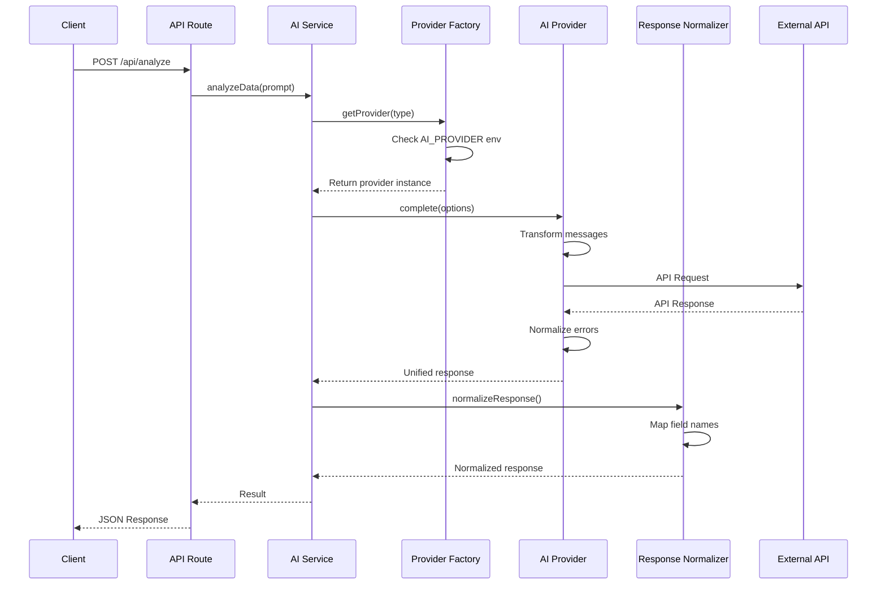

---

## Message Transformation Flow

### OpenAI (Native Support)

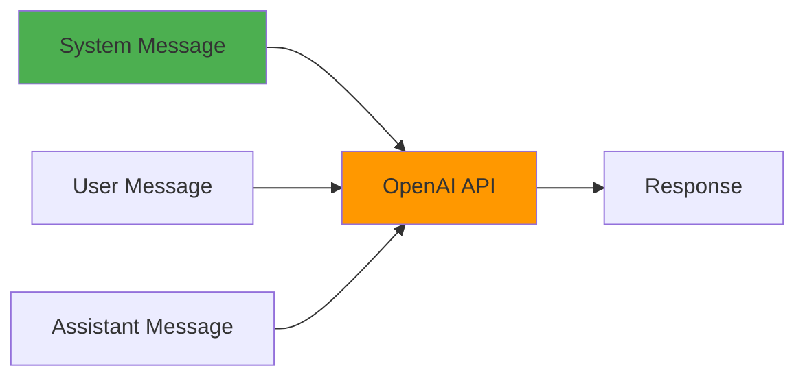

### Gemini (Transformed)

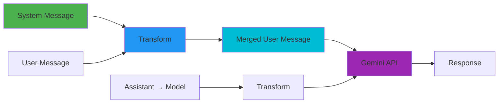

**Transformation Logic:**
```
System: "You are an expert analyst"
User: "Analyze this data: [...]"

↓ TRANSFORMS TO ↓

User: "You are an expert analyst\n\nAnalyze this data: [...]"
```

---

## Response Normalization Flow

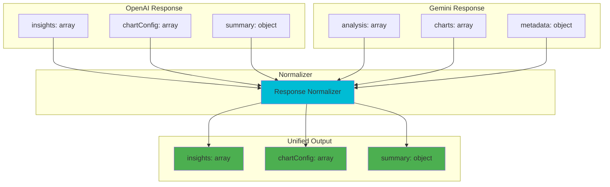

**Field Mappings:**
- `insights` ← `analysis`, `keyFindings`, `findings`, `insights`
- `chartConfig` ← `charts`, `visualizations`, `chartRecommendations`, `chartConfig`
- `summary` ← `metadata`, `context`, `summary`

---

## Error Handling Flow

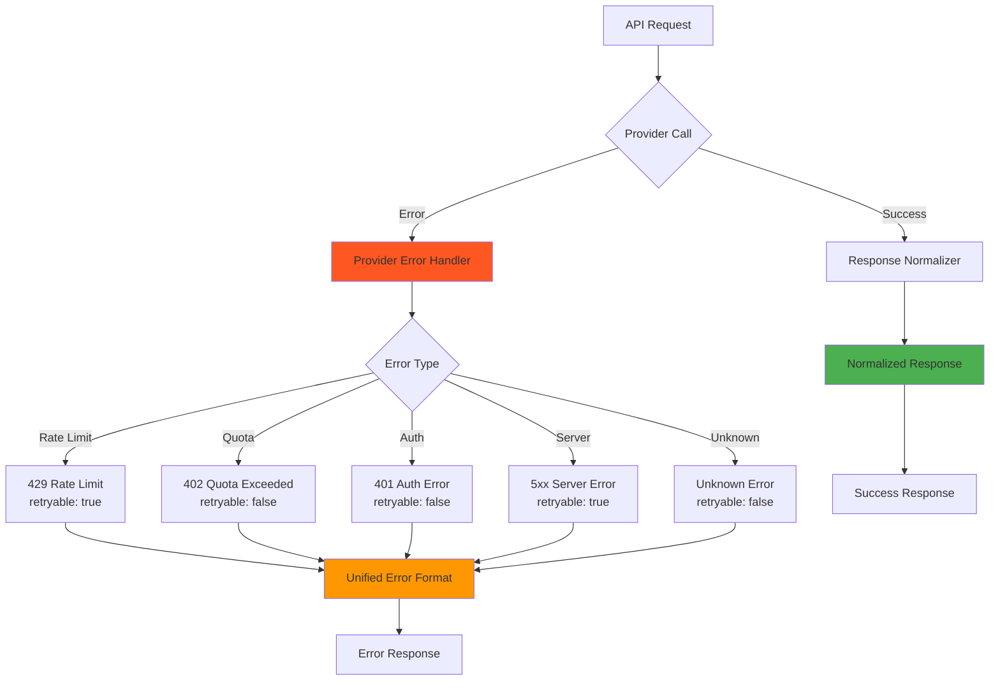

---

## Provider Selection Logic

```mermaid
graph TD
    A[getProvider()] --> B{Provider Type<br/>Specified?}

    B -->|Yes| C[Use Specified]
    B -->|No| D{Check AI_PROVIDER<br/>Environment Var}

    D -->|gemini| E[Use Gemini]
    D -->|openai| F[Use OpenAI]
    D -->|Not Set| G[Default: OpenAI]

    C --> H{Provider<br/>Available?}
    E --> H
    F --> H
    G --> H

    H -->|Yes| I[Return Provider<br/>Instance]
    H -->|No| J[Throw Error:<br/>Provider not configured]

    style I fill:#4CAF50
    style J fill:#FF5722
```

---

## Streaming Architecture

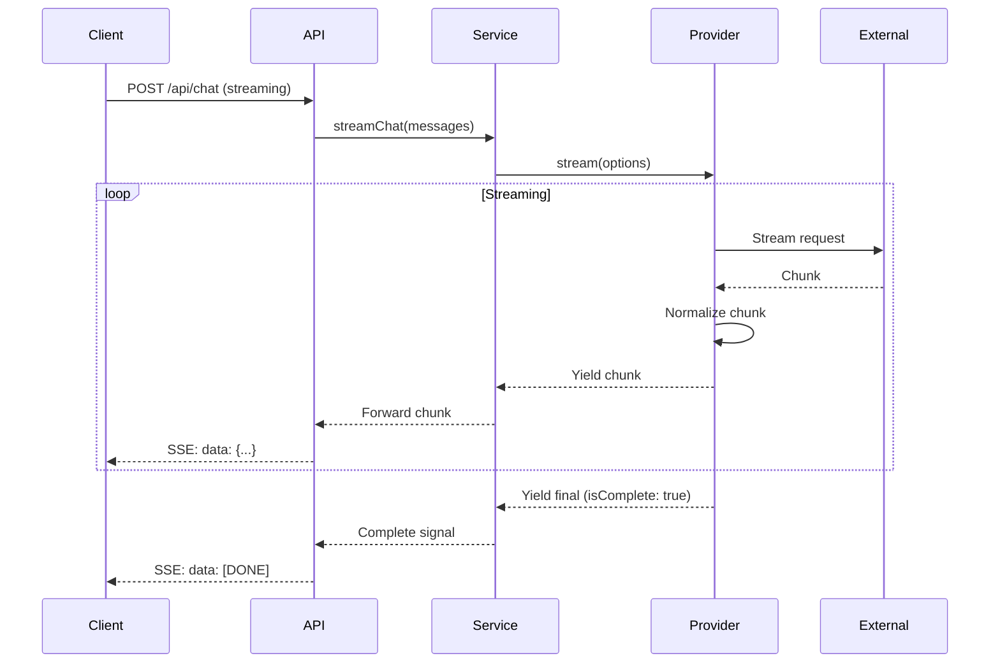

---

## JSON Mode Configuration

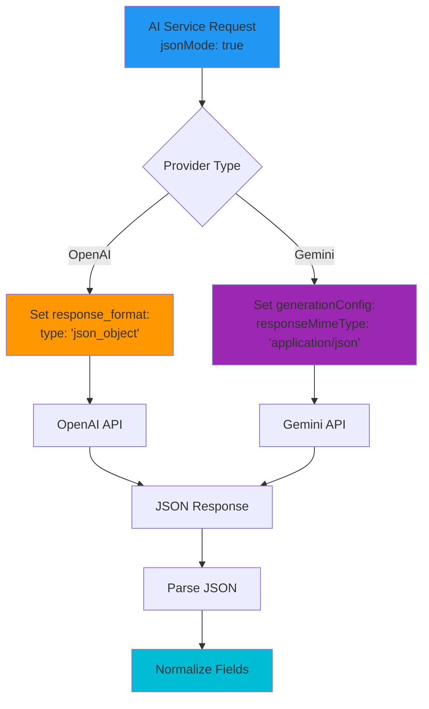

---

## Class Diagram

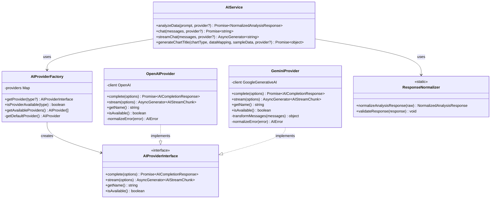

---

## File Structure

```
lib/services/ai/
├── types.ts                    # Base interfaces and types
├── normalizer.ts               # Response normalization
├── factory.ts                  # Provider factory (singleton)
├── service.ts                  # Unified AI service (singleton)
└── providers/
    ├── openai-provider.ts      # OpenAI implementation
    └── gemini-provider.ts      # Gemini implementation

app/api/
├── analyze/
│   └── route.ts                # Uses AI Service
├── analyze-simple/
│   └── route.ts                # Uses AI Service
├── chat/
│   └── route.ts                # Uses AI Service (streaming)
├── generate-chart-title/
│   └── route.ts                # Uses AI Service
└── recommendations/
    └── refresh/
        └── route.ts            # Uses AI Service
```

---

## Configuration Flow

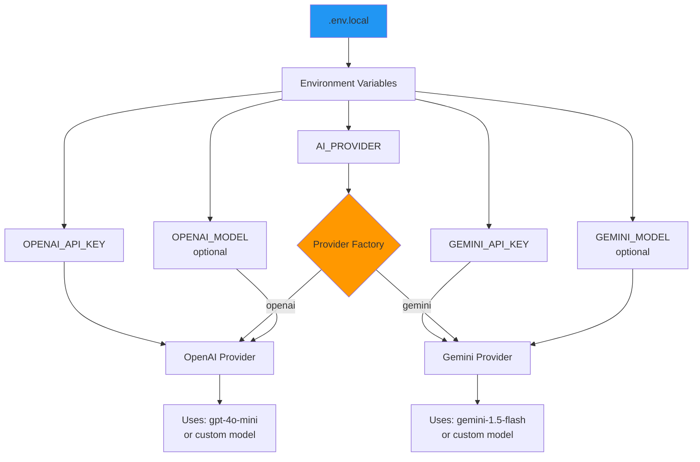

---

## Deployment Architecture

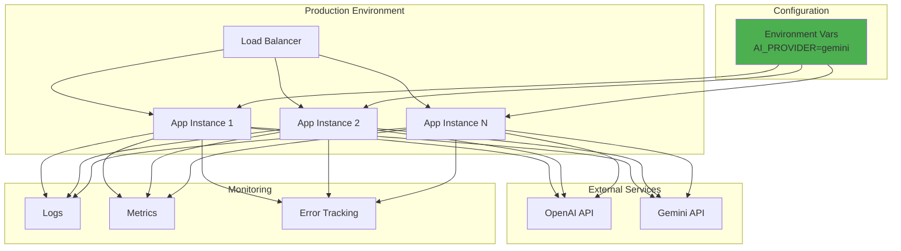

**Key Points:**
- All instances read same environment configuration
- Provider switching affects all instances simultaneously
- No code deployment needed to switch providers
- Monitoring tracks provider performance across all instances

---

## Migration Strategy

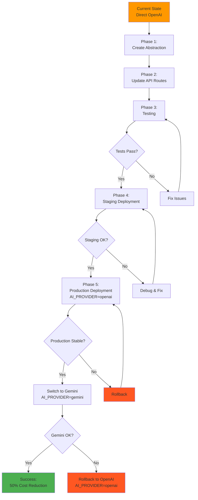

---

## Comparison Matrix

| Feature | OpenAI | Gemini | Abstraction Solution |
|---------|--------|--------|---------------------|
| System Role | ✅ Native | ❌ Not supported | Merge into user message |
| JSON Mode | `response_format` | `responseMimeType` | Provider-specific config |
| Streaming | ✅ Native | ✅ Native | Unified AsyncGenerator |
| Message Roles | system/user/assistant | user/model | Transform in provider |
| Error Format | OpenAI-specific | Gemini-specific | Normalized AIError |
| Response Fields | Standard | Varies | ResponseNormalizer |
| Cost (input) | $0.15/1M | $0.075/1M | 50% savings |
| Cost (output) | $0.60/1M | $0.30/1M | 50% savings |
| Speed | 1-3s | 0.5-2s | Generally faster |

---

## Testing Strategy

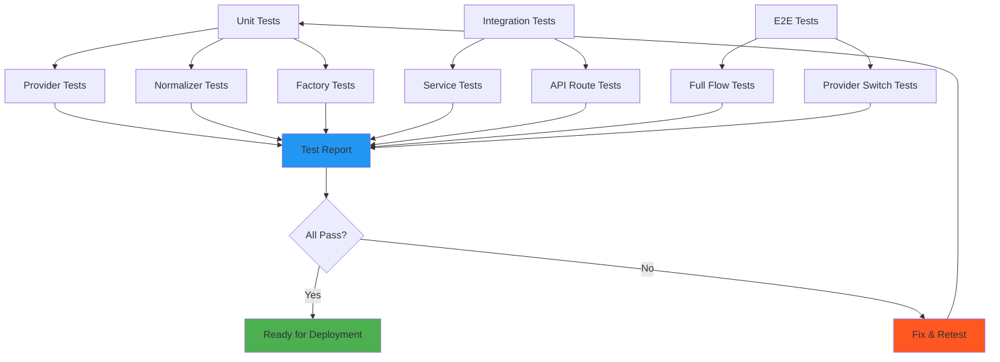

---

## Performance Monitoring

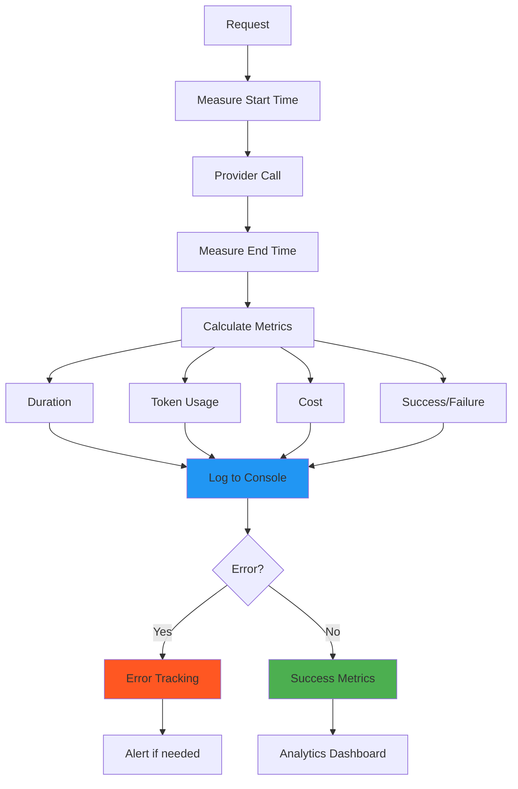

**Example Log:**
```json
{
  "event": "ai_request",
  "provider": "gemini",
  "route": "/api/analyze",
  "duration_ms": 1234,
  "tokens": {
    "input": 500,
    "output": 300,
    "total": 800
  },
  "cost_usd": 0.0003,
  "success": true
}
```

---

## Security Considerations

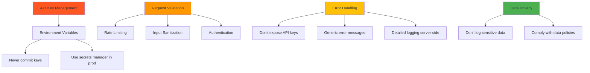

---

## Future Enhancements

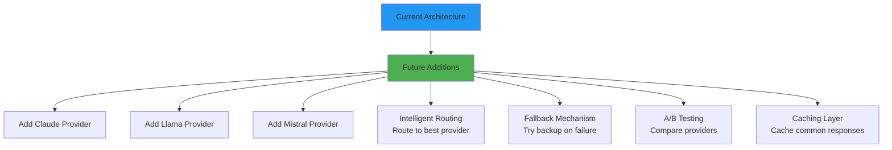

**Adding a new provider is easy:**
1. Implement `AIProviderInterface`
2. Add to factory
3. Set environment variable

**No changes needed to:**
- API routes
- AI Service
- Response normalizer
- Existing providers

---

This architecture provides a solid foundation for multi-provider AI support with minimal code changes and maximum flexibility.
