# Production Config API 403 Issue - Root Cause Analysis & Fix

## Executive Summary

**CRITICAL PRODUCTION BUG**: Dashboard config API returns 403 Forbidden immediately after project creation, causing infinite retry loops that crash the application.

**Root Cause**: Race condition between project creation and config API authorization check due to database user sync timing issue.

**Impact**: Application crashes within 30 seconds of project creation, making the product unusable.

---

## Root Cause Analysis

### The Issue Flow

1. **User creates new project** → `project-1760308333496-7eb07umzx`
2. **Project created in database** with `userId = dbUser.id` (database UUID like `clx123...`)
3. **Config API called immediately** by `loadDashboardConfig()`
4. **Authorization check fails** because:
   ```typescript
   // Line 27 in app/api/projects/[id]/config/route.ts
   if (project.userId !== authUser.uid) {
     return NextResponse.json({ error: 'Forbidden' }, { status: 403 })
   }
   ```
5. **The bug**:
   - `project.userId` = Database user ID (e.g., `clx9abc123...`)
   - `authUser.uid` = Firebase UID (e.g., `NSxVx0S6kaRVRwlvZnQPTkfDgk33`)
   - **These are NEVER equal** → Always returns 403

### Database Schema Issue

From `prisma/schema.prisma`:
```prisma
model projects {
  userId   String  // This is the database user.id (cuid)
  users    User @relation(fields: [userId], references: [id])
}

model User {
  id          String @id @default(cuid())  // Database ID
  firebaseUid String? @unique              // Firebase UID
}
```

**The problem**: The config API compares `project.userId` (database ID) with `authUser.uid` (Firebase UID), which are different identifiers for the same user.

### Why Infinite Retry Loop?

```typescript
// lib/stores/project-store.ts:663-677
loadDashboardConfig: async (projectId) => {
  const response = await fetch(`/api/projects/${projectId}/config`, {
    method: 'GET',
    headers: { 'Authorization': `Bearer ${token}` }
  })

  if (response.ok) {
    // Success path
  } else {
    console.warn('⚠️ Failed to load dashboard config')
    // NO ERROR HANDLING - fails silently
  }

  // Always falls through to localStorage check
}
```

**Frontend calls config API:**
1. In `flexible-dashboard-layout.tsx:124`: `loadDashboardConfig(currentProjectId)`
2. Called every time `currentProjectId` changes
3. No exponential backoff, no circuit breaker
4. Fails silently but logs keep accumulating
5. After 30 requests → rate limit triggers
6. Application becomes unresponsive

---

## Security Implications

### Is the 403 Correct Behavior?

**YES and NO:**

✅ **Correct**: Validating project ownership is essential
❌ **Incorrect**: Using wrong identifier comparison breaks legitimate access

### Proper Authorization Flow

```typescript
// CURRENT (WRONG)
const project = await db.projects.findUnique({ where: { id: projectId } })
if (project.userId !== authUser.uid) {  // ❌ Comparing DB ID vs Firebase UID
  return 403
}

// CORRECT
const project = await db.projects.findUnique({
  where: { id: projectId },
  include: { users: true }  // Include user relation
})
if (project.users.firebaseUid !== authUser.uid) {  // ✅ Compare Firebase UID to Firebase UID
  return 403
}
```

### Race Conditions in Project Creation

**Timeline of events:**
```
T+0ms:   User clicks "Create Project"
T+50ms:  POST /api/projects - Creates project with userId=dbUser.id
T+100ms: Project store updates currentProjectId
T+150ms: Dashboard effect triggers loadDashboardConfig()
T+200ms: GET /api/projects/[id]/config - 403 FORBIDDEN
```

**The timing issue**: Config is loaded before user has fully synced to database in some edge cases, but the main issue is the identifier mismatch.

---

## Production-Ready Fixes

### Fix 1: Correct Authorization Logic (CRITICAL)

**File**: `app/api/projects/[id]/config/route.ts`

```typescript
const getHandler = withAuth(async (request, authUser, context) => {
  try {
    const { id: projectId } = await context!.params

    // FIXED: Properly verify project ownership using Firebase UID
    const project = await db.projects.findUnique({
      where: { id: projectId },
      include: {
        users: {
          select: {
            firebaseUid: true,
            id: true
          }
        }
      }
    })

    if (!project) {
      return NextResponse.json(
        { error: 'Project not found' },
        { status: 404 }
      )
    }

    // CRITICAL FIX: Compare Firebase UIDs, not database IDs
    if (project.users.firebaseUid !== authUser.uid) {
      console.error('[CONFIG API] Authorization failed:', {
        projectId,
        projectUserId: project.users.id,
        projectFirebaseUid: project.users.firebaseUid,
        authUserUid: authUser.uid,
        match: project.users.firebaseUid === authUser.uid
      })

      return NextResponse.json(
        { error: 'Forbidden: You do not have access to this project' },
        { status: 403 }
      )
    }

    // Rest of the handler...
    const config = await db.dashboard_configs.findFirst({
      where: {
        projectId,
        userId: project.userId  // Use database user ID for config lookup
      },
      orderBy: { updatedAt: 'desc' }
    })

    if (!config) {
      // Return empty config with 200 status (NOT 404)
      return NextResponse.json({
        chartCustomizations: {},
        currentTheme: null,
        currentLayout: null,
        dashboardFilters: null,
        version: 1
      }, { status: 200 })
    }

    // ... rest of handler
  } catch (error) {
    console.error('[CONFIG API] Error:', error)
    return NextResponse.json(
      { error: 'Failed to fetch dashboard config' },
      { status: 500 }
    )
  }
})
```

### Fix 2: Exponential Backoff with Circuit Breaker

**File**: `lib/utils/api-retry.ts` (NEW)

```typescript
/**
 * API Retry Utility with Exponential Backoff and Circuit Breaker
 */

interface RetryOptions {
  maxRetries?: number
  initialDelayMs?: number
  maxDelayMs?: number
  backoffMultiplier?: number
  shouldRetry?: (error: any, attempt: number) => boolean
}

interface CircuitBreakerState {
  failures: number
  lastFailureTime: number
  state: 'closed' | 'open' | 'half-open'
}

const circuitBreakers = new Map<string, CircuitBreakerState>()

const CIRCUIT_BREAKER_THRESHOLD = 5
const CIRCUIT_BREAKER_TIMEOUT = 60000 // 1 minute

/**
 * Get or initialize circuit breaker for endpoint
 */
function getCircuitBreaker(endpoint: string): CircuitBreakerState {
  if (!circuitBreakers.has(endpoint)) {
    circuitBreakers.set(endpoint, {
      failures: 0,
      lastFailureTime: 0,
      state: 'closed'
    })
  }
  return circuitBreakers.get(endpoint)!
}

/**
 * Check if circuit breaker allows request
 */
function canAttemptRequest(endpoint: string): boolean {
  const breaker = getCircuitBreaker(endpoint)
  const now = Date.now()

  if (breaker.state === 'open') {
    // Check if timeout has elapsed
    if (now - breaker.lastFailureTime > CIRCUIT_BREAKER_TIMEOUT) {
      // Move to half-open state (allow one test request)
      breaker.state = 'half-open'
      return true
    }
    return false
  }

  return true
}

/**
 * Record success for circuit breaker
 */
function recordSuccess(endpoint: string): void {
  const breaker = getCircuitBreaker(endpoint)
  breaker.failures = 0
  breaker.state = 'closed'
}

/**
 * Record failure for circuit breaker
 */
function recordFailure(endpoint: string): void {
  const breaker = getCircuitBreaker(endpoint)
  breaker.failures++
  breaker.lastFailureTime = Date.now()

  if (breaker.failures >= CIRCUIT_BREAKER_THRESHOLD) {
    breaker.state = 'open'
    console.warn(`[CIRCUIT BREAKER] Opened for ${endpoint} after ${breaker.failures} failures`)
  }
}

/**
 * Retry a fetch request with exponential backoff
 */
export async function retryFetch<T = any>(
  url: string,
  options: RequestInit = {},
  retryOptions: RetryOptions = {}
): Promise<Response> {
  const {
    maxRetries = 3,
    initialDelayMs = 1000,
    maxDelayMs = 10000,
    backoffMultiplier = 2,
    shouldRetry = (error, attempt) => {
      // Don't retry client errors (4xx except 429)
      if (error.status >= 400 && error.status < 500 && error.status !== 429) {
        return false
      }
      return attempt < maxRetries
    }
  } = retryOptions

  // Check circuit breaker
  if (!canAttemptRequest(url)) {
    throw new Error(`Circuit breaker open for ${url}. Too many recent failures.`)
  }

  let lastError: any
  let delay = initialDelayMs

  for (let attempt = 0; attempt <= maxRetries; attempt++) {
    try {
      const response = await fetch(url, options)

      // Handle rate limiting with Retry-After header
      if (response.status === 429) {
        const retryAfter = response.headers.get('Retry-After')
        const retryDelay = retryAfter
          ? parseInt(retryAfter) * 1000
          : delay

        if (attempt < maxRetries) {
          console.warn(`[RETRY] Rate limited. Waiting ${retryDelay}ms before retry ${attempt + 1}/${maxRetries}`)
          await new Promise(resolve => setTimeout(resolve, retryDelay))
          delay = Math.min(delay * backoffMultiplier, maxDelayMs)
          continue
        }
      }

      // Success - record and return
      if (response.ok) {
        recordSuccess(url)
        return response
      }

      // Check if we should retry this error
      lastError = { status: response.status, statusText: response.statusText }
      if (!shouldRetry(lastError, attempt)) {
        recordFailure(url)
        return response // Return the error response, let caller handle it
      }

      // Retry with backoff
      if (attempt < maxRetries) {
        console.warn(`[RETRY] Attempt ${attempt + 1}/${maxRetries} failed. Waiting ${delay}ms`)
        await new Promise(resolve => setTimeout(resolve, delay))
        delay = Math.min(delay * backoffMultiplier, maxDelayMs)
      }

    } catch (error) {
      lastError = error

      // Network errors are retryable
      if (attempt < maxRetries) {
        console.warn(`[RETRY] Network error on attempt ${attempt + 1}/${maxRetries}. Waiting ${delay}ms`)
        await new Promise(resolve => setTimeout(resolve, delay))
        delay = Math.min(delay * backoffMultiplier, maxDelayMs)
      } else {
        recordFailure(url)
        throw error
      }
    }
  }

  // All retries exhausted
  recordFailure(url)
  throw lastError
}

/**
 * Reset circuit breaker for endpoint (useful for manual recovery)
 */
export function resetCircuitBreaker(endpoint: string): void {
  circuitBreakers.delete(endpoint)
  console.log(`[CIRCUIT BREAKER] Reset for ${endpoint}`)
}

/**
 * Get circuit breaker status for monitoring
 */
export function getCircuitBreakerStatus(): Record<string, CircuitBreakerState> {
  return Object.fromEntries(circuitBreakers.entries())
}
```

### Fix 3: Graceful Config Loading with Fallback

**File**: `lib/stores/project-store.ts:663-731`

```typescript
loadDashboardConfig: async (projectId) => {
  // Step 1: Try to load from database API first
  try {
    console.log('🌐 [PROJECT_STORE] Loading dashboard config from database...')
    const token = await auth.currentUser?.getIdToken()

    if (token) {
      // Use retry mechanism with circuit breaker
      const response = await retryFetch(`/api/projects/${projectId}/config`, {
        method: 'GET',
        headers: { 'Authorization': `Bearer ${token}` }
      }, {
        maxRetries: 3,
        initialDelayMs: 500,
        shouldRetry: (error, attempt) => {
          // Don't retry 403 (auth error) or 404 (not found)
          if (error.status === 403 || error.status === 404) {
            return false
          }
          // Retry 429 (rate limit) and 5xx (server errors)
          return attempt < 3 && (error.status === 429 || error.status >= 500)
        }
      })

      if (response.ok) {
        const result = await response.json()
        console.log('✅ [PROJECT_STORE] Dashboard config loaded from database')

        // Save to localStorage for quick access
        const now = new Date().toISOString()
        set((state) => ({
          projects: state.projects.map(p =>
            p.id === projectId
              ? {
                  ...p,
                  dashboardConfig: {
                    chartCustomizations: result.chartCustomizations,
                    currentLayout: result.currentLayout,
                    filters: result.dashboardFilters,
                    theme: result.currentTheme,
                    lastModified: result.lastModified || now
                  },
                  updatedAt: now
                }
              : p
          ),
          isDirty: false,
          lastSavedAt: result.lastModified || now
        }))

        return {
          chartCustomizations: result.chartCustomizations,
          currentLayout: result.currentLayout,
          filters: result.dashboardFilters,
          theme: result.currentTheme
        }
      } else {
        const status = response.status
        const errorText = await response.text()

        // Log different error types differently
        if (status === 403) {
          console.error('❌ [PROJECT_STORE] Authorization failed for config:', {
            projectId,
            status,
            error: errorText
          })
        } else if (status === 404) {
          console.log('ℹ️ [PROJECT_STORE] No config exists yet (expected for new projects)')
        } else {
          console.warn('⚠️ [PROJECT_STORE] Failed to load config:', status, errorText)
        }
      }
    } else {
      console.warn('⚠️ [PROJECT_STORE] No auth token, skipping database load')
    }
  } catch (error) {
    // Circuit breaker may have triggered
    if (error instanceof Error && error.message.includes('Circuit breaker')) {
      console.error('🔴 [PROJECT_STORE] Circuit breaker open, too many failures:', error.message)
    } else {
      console.error('❌ [PROJECT_STORE] Error loading config from database:', error)
    }
  }

  // Step 2: Fallback to localStorage (offline support)
  console.log('💾 [PROJECT_STORE] Loading dashboard config from localStorage')
  const project = get().projects.find(p => p.id === projectId)
  if (project?.dashboardConfig) {
    const { lastModified, ...config } = project.dashboardConfig
    set({ isDirty: false, lastSavedAt: project.dashboardConfig.lastModified })
    return config
  }

  console.log('ℹ️ [PROJECT_STORE] No dashboard config found (new project)')
  return null
}
```

### Fix 4: Same Authorization Fix for PUT Endpoint

Apply the same fix to the PUT handler in `app/api/projects/[id]/config/route.ts`:

```typescript
const putHandler = withAuth(async (request, authUser, context) => {
  try {
    const { id: projectId } = await context!.params

    // FIXED: Properly verify project ownership
    const project = await db.projects.findUnique({
      where: { id: projectId },
      include: {
        users: {
          select: {
            firebaseUid: true,
            id: true
          }
        }
      }
    })

    if (!project) {
      return NextResponse.json({ error: 'Project not found' }, { status: 404 })
    }

    // CRITICAL FIX: Compare Firebase UIDs
    if (project.users.firebaseUid !== authUser.uid) {
      return NextResponse.json({ error: 'Forbidden' }, { status: 403 })
    }

    // Use database user ID for config operations
    const dbUserId = project.userId

    // ... rest of PUT handler using dbUserId
  } catch (error) {
    console.error('[CONFIG API] PUT error:', error)
    return NextResponse.json(
      { error: 'Failed to save dashboard config' },
      { status: 500 }
    )
  }
})
```

---

## Architecture Improvements

### 1. Config Loading Should Be Optional

**Recommendation**: Dashboard should work without saved config.

```typescript
// components/dashboard/flexible-dashboard-layout.tsx:122-138
useEffect(() => {
  if (currentProjectId) {
    loadDashboardConfig(currentProjectId)
      .then(savedConfig => {
        if (savedConfig) {
          // Apply saved config
          Object.entries(savedConfig.chartCustomizations).forEach(([chartId, customization]) => {
            updateChartCustomization(chartId, customization)
          })
        } else {
          // NEW: Use default config for new projects
          console.log('No saved config, using defaults')
        }
      })
      .catch(error => {
        // IMPROVED: Don't crash on config load failure
        console.warn('Config load failed, using defaults:', error)
      })
  }
}, [currentProjectId, loadDashboardConfig])
```

### 2. Graceful Degradation

```typescript
// Priority order for config loading:
// 1. Database (authoritative source)
// 2. localStorage (fast fallback)
// 3. Defaults (always works)

function getConfigWithFallback(projectId: string) {
  try {
    // Try database
    const dbConfig = await loadFromDatabase(projectId)
    if (dbConfig) return dbConfig
  } catch (error) {
    console.warn('Database config failed, trying localStorage')
  }

  try {
    // Try localStorage
    const localConfig = loadFromLocalStorage(projectId)
    if (localConfig) return localConfig
  } catch (error) {
    console.warn('localStorage config failed, using defaults')
  }

  // Return defaults
  return getDefaultConfig()
}
```

### 3. Race Condition Prevention

**Option A: Optimistic Project Creation**
```typescript
// Create project and config in single transaction
async function createProjectWithConfig(projectData) {
  return db.$transaction(async (tx) => {
    const project = await tx.projects.create({ data: projectData })

    // Create empty config immediately
    await tx.dashboard_configs.create({
      data: {
        id: `${userId}_${project.id}`,
        userId,
        projectId: project.id,
        chartCustomizations: '{}',
        version: 1,
        updatedAt: new Date()
      }
    })

    return project
  })
}
```

**Option B: Delayed Config Load**
```typescript
// Wait for project to fully sync before loading config
async function createProject(projectData) {
  const project = await apiClient.createProject(projectData)

  // Wait 500ms for database consistency
  await new Promise(resolve => setTimeout(resolve, 500))

  // Now safe to load config
  await loadDashboardConfig(project.id)
}
```

### 4. Rate Limiting Strategy

**Current issues:**
- No distinction between retry failures and genuine abuse
- Rate limit triggers after legitimate failures
- No recovery mechanism

**Improved strategy:**
```typescript
// lib/middleware/rate-limit.ts
export const RATE_LIMITS = {
  CONFIG_GET: {
    windowMs: 60000,      // 1 minute
    max: 10,              // 10 requests per minute (down from 30)
    skipFailedRequests: true,  // Don't count 4xx/5xx against limit
    keyGenerator: (req) => {
      // Separate limits per project
      const projectId = req.url.split('/projects/')[1]?.split('/')[0]
      return `${req.user.uid}:${projectId}`
    }
  }
}
```

---

## Testing Recommendations

### Unit Tests

```typescript
describe('Config API Authorization', () => {
  it('should allow owner to access project config', async () => {
    const project = await createTestProject(testUser)
    const response = await getConfig(project.id, testUser.firebaseUid)
    expect(response.status).toBe(200)
  })

  it('should deny non-owner access to project config', async () => {
    const project = await createTestProject(testUser)
    const response = await getConfig(project.id, otherUser.firebaseUid)
    expect(response.status).toBe(403)
  })

  it('should handle missing config gracefully', async () => {
    const project = await createTestProject(testUser)
    const response = await getConfig(project.id, testUser.firebaseUid)
    expect(response.status).toBe(200)
    expect(response.body.chartCustomizations).toEqual({})
  })
})
```

### Integration Tests

```typescript
describe('Project Creation Flow', () => {
  it('should allow config access immediately after project creation', async () => {
    // Create project
    const project = await createProject({ name: 'Test' })

    // Immediate config access should work
    const config = await loadDashboardConfig(project.id)
    expect(config).not.toBeNull()
  })

  it('should handle config load failure gracefully', async () => {
    const project = await createProject({ name: 'Test' })

    // Simulate API failure
    mockConfigAPI.fail()

    // Should not crash
    const config = await loadDashboardConfig(project.id)
    expect(config).toBeNull() // Falls back to null
  })
})
```

### Load Tests

```bash
# Test rate limiting with retry logic
for i in {1..50}; do
  curl -H "Authorization: Bearer $TOKEN" \
    http://localhost:3000/api/projects/$PROJECT_ID/config &
done

# Should handle gracefully without crashing
```

---

## Migration Plan

### Phase 1: Immediate Hotfix (Deploy Today)

1. **Fix authorization logic** in config API (Fix #1)
2. **Add better error logging** to identify issues
3. **Deploy with feature flag** to enable rollback

```bash
# Deploy with feature flag
FEATURE_NEW_CONFIG_AUTH=true npm run deploy
```

### Phase 2: Add Retry Logic (Deploy This Week)

1. **Implement retry utility** with circuit breaker (Fix #2)
2. **Update project-store** to use retry logic (Fix #3)
3. **Add monitoring** for circuit breaker states

### Phase 3: Architecture Improvements (Deploy Next Week)

1. **Implement graceful degradation** with fallbacks
2. **Add config creation** in project transaction
3. **Improve rate limiting** strategy (Fix #4)
4. **Add comprehensive tests**

### Phase 4: Long-term Improvements (Next Sprint)

1. **Consider GraphQL** for better batching
2. **Add caching layer** (Redis) for frequently accessed configs
3. **Implement WebSocket** for real-time config sync
4. **Add metrics dashboard** for monitoring

---

## Monitoring & Alerting

### Metrics to Track

```typescript
// Add to logging/monitoring service
{
  metric: 'config_api.authorization_failures',
  labels: {
    reason: 'uid_mismatch' | 'project_not_found' | 'no_token'
  }
}

{
  metric: 'config_api.circuit_breaker_state',
  labels: {
    endpoint: '/api/projects/[id]/config',
    state: 'open' | 'closed' | 'half-open'
  }
}

{
  metric: 'config_api.retry_count',
  labels: {
    attempt: number,
    success: boolean
  }
}
```

### Alerts to Set Up

```yaml
alerts:
  - name: ConfigAPI403Rate
    condition: rate(config_api_403_errors) > 5/min
    severity: critical
    message: "High rate of 403 errors on config API"

  - name: CircuitBreakerOpen
    condition: circuit_breaker_state == 'open'
    severity: warning
    message: "Circuit breaker opened for config API"

  - name: ConfigAPILatency
    condition: p95(config_api_latency) > 2000ms
    severity: warning
    message: "Config API latency degraded"
```

---

## Summary

### Critical Issues Fixed

1. ✅ **Authorization bug**: Compare Firebase UIDs instead of mixing database IDs
2. ✅ **Infinite retry loop**: Add exponential backoff with circuit breaker
3. ✅ **Error handling**: Graceful degradation with fallbacks
4. ✅ **Rate limiting**: Smarter limits that don't penalize legitimate failures

### Architecture Improvements

1. ✅ **Graceful degradation**: Database → localStorage → defaults
2. ✅ **Circuit breaker**: Prevent cascading failures
3. ✅ **Better logging**: Identify issues faster
4. ✅ **Monitoring**: Track health metrics

### Success Criteria

- [ ] No 403 errors for legitimate project owners
- [ ] Config API responds within 200ms (p95)
- [ ] Circuit breaker prevents crashes under load
- [ ] Dashboard works even if config API fails
- [ ] Zero application crashes due to config loading

---

## Appendix: Mermaid Diagrams

### Current (Broken) Flow


### Fixed Flow

```mermaid
sequenceDiagram
    participant U as User
    participant F as Frontend
    participant API as Config API
    participant DB as Database
    participant CB as Circuit Breaker

    U->>F: Create Project
    F->>API: POST /api/projects
    API->>DB: INSERT project (userId=dbUserId)
    DB-->>API: ✅ Created
    API-->>F: project { id, userId: "clx123..." }

    F->>F: Set currentProjectId
    F->>F: useEffect triggers
    F->>CB: Check circuit state
    CB-->>F: ✅ Closed (OK to proceed)

    F->>API: GET /api/projects/{id}/config
    API->>DB: SELECT project WITH users
    DB-->>API: { userId: "clx123...", users: { firebaseUid: "NSxVx0..." } }

    Note over API: Compare users.firebaseUid vs authUser.uid
    Note over API: "NSxVx0..." === "NSxVx0..." ✅

    API->>DB: SELECT dashboard_config
    DB-->>API: null (new project)

    API-->>F: ✅ 200 OK { chartCustomizations: {} }

    F->>F: Apply config (empty is OK)
    Note over F: Dashboard renders successfully
```



### Retry Flow with Circuit Breaker


---

## Quick Command Reference

```bash
# Check circuit breaker status
curl http://localhost:3000/api/debug/circuit-breakers

# Reset circuit breaker for endpoint
curl -X POST http://localhost:3000/api/debug/circuit-breakers/reset \
  -d '{"endpoint": "/api/projects/*/config"}'

# Monitor config API calls
tail -f logs/config-api.log | grep "403"

# Test authorization fix
curl -H "Authorization: Bearer $TOKEN" \
  http://localhost:3000/api/projects/$PROJECT_ID/config

# Check database user sync
psql $DATABASE_URL -c "SELECT id, firebaseUid FROM users WHERE firebaseUid='$FIREBASE_UID';"
```

---

**Document Version**: 1.0
**Last Updated**: 2025-10-14
**Author**: Claude (System Architect)
**Status**: Ready for Implementation
