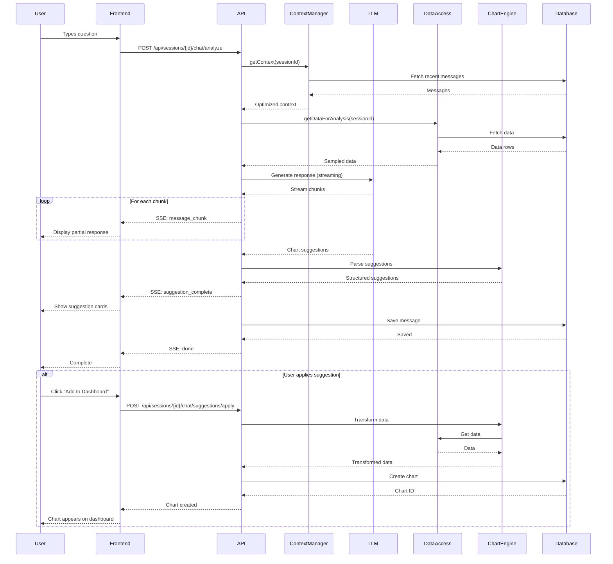
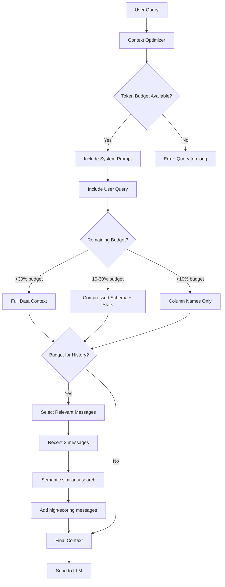

# AI-Powered Data Analysis Chat System - Backend Architecture

## Executive Summary

This document outlines the comprehensive backend architecture for an AI-powered data analysis chat system that enables natural language interaction with user data, contextual prompt generation, and intelligent visualization recommendations.

**Key Capabilities:**
- Natural language queries about user data
- Context-aware conversation with data understanding
- Dynamic visualization recommendations
- Streaming responses for real-time interaction
- Efficient context window management
- Integration with existing dashboard infrastructure

---

## 1. API Design

### 1.1 Core Endpoints

#### POST /api/sessions/{sessionId}/chat/analyze
**Purpose:** Send a natural language question about data and receive analysis with visualization recommendations

**Request:**
```typescript
interface AnalyzeChatRequest {
  message: string                    // User's natural language question
  conversationHistory?: ChatMessage[] // Last N messages for context
  dataContext?: {
    fileName: string
    rowCount: number
    columnCount: number
    columns: ColumnSchema[]
    businessDomain?: string          // e.g., "e-commerce", "marketing"
  }
  options?: {
    includeChartSuggestions: boolean // Default: true
    maxSuggestions: number           // Default: 3
    streaming: boolean               // Default: true
    temperature?: number             // 0.0-1.0, Default: 0.3
  }
}
```

**Response (Streaming):**
```typescript
// Server-Sent Events (SSE) format
event: message_chunk
data: { content: string }

event: suggestion_start
data: { suggestionId: string }

event: suggestion_chunk
data: { suggestionId: string, field: string, value: any }

event: suggestion_complete
data: { suggestion: ChartSuggestion }

event: message_complete
data: {
  messageId: string
  totalSuggestions: number
  confidence: number
  metadata: {
    tokensUsed: number
    processingTimeMs: number
  }
}

event: done
data: [DONE]
```

**Response (Non-Streaming):**
```typescript
interface AnalyzeChatResponse {
  messageId: string
  content: string                    // AI response text
  suggestions: ChartSuggestion[]     // Visualization recommendations
  insights: string[]                 // Key insights from analysis
  followUpQuestions: string[]        // Suggested next questions
  confidence: number                 // 0.0-1.0
  metadata: {
    tokensUsed: number
    processingTimeMs: number
    dataRowsAnalyzed: number
  }
}
```

**Error Responses:**
```typescript
// 400 Bad Request
{
  error: "Invalid request",
  details: "Message cannot be empty",
  code: "INVALID_MESSAGE"
}

// 429 Too Many Requests
{
  error: "Rate limit exceeded",
  retryAfter: 60,  // seconds
  code: "RATE_LIMIT"
}

// 500 Internal Server Error
{
  error: "Analysis failed",
  details: "LLM service unavailable",
  code: "LLM_ERROR",
  suggestion: "Please try again in a few moments"
}
```

---

#### GET /api/sessions/{sessionId}/chat/context
**Purpose:** Retrieve the current conversation context and data summary

**Response:**
```typescript
interface ChatContextResponse {
  sessionId: string
  messageCount: number
  dataContext: {
    fileName: string
    rowCount: number
    columnCount: number
    dateRange?: { from: Date, to: Date }
    keyMetrics: Array<{ name: string, value: number }>
    businessDomain: string
  }
  recentMessages: ChatMessage[]      // Last 10 messages
  activeFilters: DashboardFilter[]
  currentDashboard: {
    chartCount: number
    charts: Array<{ id: string, type: string, title: string }>
  }
}
```

---

#### POST /api/sessions/{sessionId}/chat/suggestions/apply
**Purpose:** Apply a chart suggestion to the dashboard

**Request:**
```typescript
interface ApplySuggestionRequest {
  suggestionId: string
  customization?: {
    title?: string
    position?: { x: number, y: number, w: number, h: number }
    colors?: string[]
  }
}
```

**Response:**
```typescript
interface ApplySuggestionResponse {
  success: boolean
  chartId: string
  chart: {
    id: string
    type: ChartType
    title: string
    dataMapping: any
  }
}
```

---

#### POST /api/sessions/{sessionId}/chat/prompts/generate
**Purpose:** Generate contextual prompts based on current data and dashboard state

**Request:**
```typescript
interface GeneratePromptsRequest {
  count?: number                     // Number of prompts to generate (default: 5)
  categories?: ('insights' | 'trends' | 'comparisons' | 'anomalies')[]
  focusAreas?: string[]              // Specific columns or metrics to focus on
}
```

**Response:**
```typescript
interface GeneratePromptsResponse {
  prompts: Array<{
    id: string
    category: 'insights' | 'trends' | 'comparisons' | 'anomalies'
    prompt: string
    confidence: number
    reasoning: string                // Why this prompt is relevant
    expectedChartType?: ChartType    // What visualization would likely be created
  }>
  metadata: {
    dataAnalyzed: boolean
    contextFactorsUsed: string[]     // e.g., ["column_types", "date_range", "existing_charts"]
  }
}
```

**Example Response:**
```json
{
  "prompts": [
    {
      "id": "prompt_1",
      "category": "trends",
      "prompt": "Show me how sales have trended over the past 3 months",
      "confidence": 0.92,
      "reasoning": "Dataset contains date column and sales metric with 90 days of data",
      "expectedChartType": "line"
    },
    {
      "id": "prompt_2",
      "category": "comparisons",
      "prompt": "Which product categories are generating the most revenue?",
      "confidence": 0.88,
      "reasoning": "Product_category column has 8 unique values, revenue column present",
      "expectedChartType": "bar"
    }
  ]
}
```

---

#### DELETE /api/sessions/{sessionId}/chat
**Purpose:** Clear chat history for a session

**Response:**
```typescript
{
  success: boolean
  deletedCount: number
}
```

---

### 1.2 Streaming vs Batch Considerations

**Use Streaming When:**
- User is actively viewing the chat interface
- Response length > 500 tokens
- Interactive, conversational experience is desired
- Real-time feedback improves UX

**Use Batch When:**
- Background processing (e.g., auto-generating prompts)
- Need atomic responses for testing
- Client doesn't support SSE
- Storing/logging complete responses

**Implementation:**
```typescript
// API route handler
export async function POST(request: NextRequest) {
  const { streaming = true } = await request.json()

  if (streaming) {
    // Return SSE stream
    const encoder = new TextEncoder()
    const stream = new ReadableStream({
      async start(controller) {
        // Stream chunks
        for await (const chunk of generateResponse()) {
          controller.enqueue(
            encoder.encode(`data: ${JSON.stringify(chunk)}\n\n`)
          )
        }
        controller.close()
      }
    })

    return new Response(stream, {
      headers: {
        'Content-Type': 'text/event-stream',
        'Cache-Control': 'no-cache',
        'Connection': 'keep-alive',
      }
    })
  } else {
    // Return complete response
    const response = await generateCompleteResponse()
    return NextResponse.json(response)
  }
}
```

---

## 2. Prompt Engineering

### 2.1 System Prompts

#### Core Data Analysis System Prompt
```typescript
const DATA_ANALYST_SYSTEM_PROMPT = `You are an expert data analyst assistant helping users understand their data through natural language.

CAPABILITIES:
- Analyze data patterns, trends, and anomalies
- Recommend appropriate visualizations
- Answer questions about specific metrics and dimensions
- Provide actionable business insights

RESPONSE FORMAT:
1. Directly answer the user's question
2. Provide 2-3 specific insights from the data
3. Recommend 1-3 visualizations using CHART_SUGGESTION format (if applicable)
4. Suggest 2 follow-up questions

CHART_SUGGESTION FORMAT:
\`\`\`json
{
  "id": "unique_id",
  "type": "line|bar|pie|scatter|table|scorecard|area|waterfall|funnel|heatmap",
  "title": "Clear, specific title",
  "description": "What this chart shows",
  "confidence": 0.0-1.0,
  "reasoning": "Why this visualization is appropriate",
  "dataTransform": {
    "filter": [{"column": "col_name", "operator": "equals", "value": "value"}],
    "orderBy": [{"column": "col_name", "direction": "desc"}],
    "limit": 10,
    "columns": [{"name": "col", "expression": "SQL_EXPR", "alias": "new_name"}],
    "groupBy": ["col1", "col2"],
    "aggregations": [{"column": "metric", "function": "sum|avg|count", "alias": "result"}]
  },
  "chartConfig": {
    "xAxis": "column_name",
    "yAxis": ["metric1", "metric2"]
  },
  "tableConfig": {
    "columns": [
      {"key": "col_name", "label": "Display Name", "type": "text|number|currency|percentage", "sortable": true}
    ],
    "sortBy": "column_name",
    "sortOrder": "asc|desc",
    "pagination": true,
    "pageSize": 10
  },
  "priority": "high|medium|low",
  "tags": ["category1", "category2"]
}
\`\`\`

GUIDELINES:
- Be concise and specific
- Use actual column names from the data
- Highlight unexpected patterns or outliers
- Provide business context when possible
- If data is insufficient, explain what's needed
- Always validate that referenced columns exist
`

interface SystemPromptBuilder {
  buildPrompt(context: DataContext, userHistory?: string[]): string
}

class DataAnalystPromptBuilder implements SystemPromptBuilder {
  buildPrompt(context: DataContext, userHistory?: string[]): string {
    let prompt = DATA_ANALYST_SYSTEM_PROMPT

    // Add data context
    prompt += `\n\nCURRENT DATA CONTEXT:\n`
    prompt += `Dataset: ${context.fileName}\n`
    prompt += `Domain: ${context.businessDomain || 'General'}\n`
    prompt += `Rows: ${context.rowCount.toLocaleString()}\n`
    prompt += `Columns (${context.columnCount}):\n`

    context.columns.forEach(col => {
      prompt += `  - ${col.name} (${col.type})`
      if (col.description) prompt += ` - ${col.description}`
      if (col.suggestedUsage?.length) {
        prompt += ` [Use for: ${col.suggestedUsage.join(', ')}]`
      }
      prompt += `\n`
    })

    // Add business context if available
    if (context.businessContext) {
      prompt += `\nBUSINESS CONTEXT:\n${context.businessContext}\n`
    }

    // Add key entities
    if (context.keyEntities?.length) {
      prompt += `\nKEY ENTITIES:\n`
      context.keyEntities.forEach(entity => {
        prompt += `  - ${entity.name}: ${entity.description}\n`
      })
    }

    // Add time context
    if (context.timeGranularity !== 'none') {
      prompt += `\nTIME DIMENSION: Data is at ${context.timeGranularity} granularity\n`
    }

    return prompt
  }
}
```

---

### 2.2 Data Context Injection

**Strategy: Adaptive Context Compression**

```typescript
interface ContextInjector {
  injectDataContext(
    prompt: string,
    dataContext: DataContext,
    options: {
      maxTokens: number          // Available context budget
      priority: 'schema' | 'samples' | 'statistics' | 'balanced'
      includeSamples: boolean
      sampleSize: number
    }
  ): string
}

class AdaptiveContextInjector implements ContextInjector {

  injectDataContext(prompt: string, context: DataContext, options): string {
    const budget = options.maxTokens
    let tokensUsed = 0
    let injectedContext = ''

    // 1. Always include schema (highest priority) - ~20% of budget
    const schemaTokens = Math.floor(budget * 0.2)
    const schema = this.compressSchema(context.columns, schemaTokens)
    injectedContext += `SCHEMA:\n${schema}\n\n`
    tokensUsed += this.estimateTokens(schema)

    // 2. Add statistics if requested - ~30% of budget
    if (options.priority === 'statistics' || options.priority === 'balanced') {
      const statsTokens = Math.floor(budget * 0.3)
      const stats = this.generateStatisticsSummary(context, statsTokens)
      injectedContext += `STATISTICS:\n${stats}\n\n`
      tokensUsed += this.estimateTokens(stats)
    }

    // 3. Add sample data if requested - remaining budget
    if (options.includeSamples && budget - tokensUsed > 500) {
      const sampleTokens = budget - tokensUsed
      const samples = this.sampleData(context.data, options.sampleSize, sampleTokens)
      injectedContext += `SAMPLE DATA (first ${options.sampleSize} rows):\n${samples}\n\n`
    }

    return `${injectedContext}USER QUESTION: ${prompt}`
  }

  private compressSchema(columns: ColumnSchema[], maxTokens: number): string {
    // Use abbreviated format for large schemas
    if (this.estimateTokens(this.fullSchema(columns)) > maxTokens) {
      return columns.map(c =>
        `${c.name}:${c.type}${c.suggestedUsage ? `[${c.suggestedUsage[0]}]` : ''}`
      ).join(', ')
    }
    return this.fullSchema(columns)
  }

  private fullSchema(columns: ColumnSchema[]): string {
    return columns.map(c => {
      let line = `${c.name} (${c.type})`
      if (c.description) line += ` - ${c.description}`
      if (c.uniqueValues < 20) line += ` [${c.uniqueValues} unique values]`
      return line
    }).join('\n')
  }

  private estimateTokens(text: string): number {
    // Rough estimate: 1 token ≈ 4 characters
    return Math.ceil(text.length / 4)
  }

  private generateStatisticsSummary(context: DataContext, maxTokens: number): string {
    const summary: string[] = []

    context.columns
      .filter(c => c.type === 'number' && c.stats)
      .forEach(col => {
        const stats = col.stats!
        summary.push(
          `${col.name}: min=${stats.min}, max=${stats.max}, avg=${stats.avg?.toFixed(2)}, null=${col.nullPercentage.toFixed(1)}%`
        )
      })

    return summary.join('\n')
  }

  private sampleData(data: DataRow[], sampleSize: number, maxTokens: number): string {
    const sample = data.slice(0, sampleSize)
    const json = JSON.stringify(sample, null, 2)

    // If sample is too large, reduce and try again
    if (this.estimateTokens(json) > maxTokens && sampleSize > 3) {
      return this.sampleData(data, Math.floor(sampleSize / 2), maxTokens)
    }

    return json
  }
}
```

---

### 2.3 Prompt Templates for Different Use Cases

```typescript
const PROMPT_TEMPLATES = {

  // When user asks about trends
  TREND_ANALYSIS: {
    template: `Analyze trends in {metric} over {timeColumn}.
Context: Dataset has {rowCount} rows spanning {dateRange}.
Focus on: Recent patterns, seasonal effects, anomalies.
Include: Line chart with trend line, insights on direction and volatility.`,

    requiredFields: ['metric', 'timeColumn', 'rowCount', 'dateRange']
  },

  // When user asks for comparisons
  COMPARISON: {
    template: `Compare {metric} across different {dimension}.
Context: {dimension} has {uniqueCount} unique values.
Focus on: Top/bottom performers, outliers, distribution.
Include: Bar chart sorted by {metric}, table with rankings.`,

    requiredFields: ['metric', 'dimension', 'uniqueCount']
  },

  // When user asks about correlations
  CORRELATION: {
    template: `Analyze relationship between {metric1} and {metric2}.
Context: Both metrics are numeric with {rowCount} data points.
Focus on: Correlation strength, direction, outliers, clusters.
Include: Scatter plot with regression line, correlation coefficient.`,

    requiredFields: ['metric1', 'metric2', 'rowCount']
  },

  // When user asks open-ended questions
  EXPLORATORY: {
    template: `Explore and summarize insights from the dataset.
Context: {columnCount} columns, {rowCount} rows, domain: {domain}.
Key metrics: {keyMetrics}.
Focus on: Most interesting patterns, unexpected findings, actionable insights.
Include: 2-3 different visualizations showing key patterns.`,

    requiredFields: ['columnCount', 'rowCount', 'domain', 'keyMetrics']
  },

  // When user wants optimization insights
  OPTIMIZATION: {
    template: `Identify optimization opportunities in {metric}.
Context: Current performance - {currentStats}.
Focus on: Underperformers, inefficiencies, improvement potential.
Include: Table of optimization candidates, Pareto chart, actionable recommendations.`,

    requiredFields: ['metric', 'currentStats']
  }
}

class PromptTemplateEngine {

  generatePrompt(
    templateKey: keyof typeof PROMPT_TEMPLATES,
    variables: Record<string, any>
  ): string {
    const template = PROMPT_TEMPLATES[templateKey]

    // Validate required fields
    const missing = template.requiredFields.filter(field => !variables[field])
    if (missing.length > 0) {
      throw new Error(`Missing required fields: ${missing.join(', ')}`)
    }

    // Replace variables
    let prompt = template.template
    Object.entries(variables).forEach(([key, value]) => {
      prompt = prompt.replace(new RegExp(`{${key}}`, 'g'), String(value))
    })

    return prompt
  }

  detectTemplateFromQuery(query: string): keyof typeof PROMPT_TEMPLATES | null {
    const lowerQuery = query.toLowerCase()

    if (lowerQuery.match(/trend|over time|timeline|historical/)) {
      return 'TREND_ANALYSIS'
    }
    if (lowerQuery.match(/compare|versus|vs|difference between/)) {
      return 'COMPARISON'
    }
    if (lowerQuery.match(/correlation|relationship|related to|impact of/)) {
      return 'CORRELATION'
    }
    if (lowerQuery.match(/optimize|improve|reduce|inefficien|waste/)) {
      return 'OPTIMIZATION'
    }

    return 'EXPLORATORY'
  }
}
```

---

### 2.4 Contextual Prompt Generation

```typescript
interface ContextualPromptGenerator {
  generatePrompts(context: {
    dataContext: DataContext
    existingCharts: Chart[]
    recentQueries: string[]
    dashboardFilters: DashboardFilter[]
  }): GeneratedPrompt[]
}

class SmartPromptGenerator implements ContextualPromptGenerator {

  generatePrompts(context): GeneratedPrompt[] {
    const prompts: GeneratedPrompt[] = []

    // 1. Analyze what's NOT yet visualized
    const unusedColumns = this.findUnusedColumns(
      context.dataContext.columns,
      context.existingCharts
    )

    unusedColumns.forEach(col => {
      if (col.type === 'number') {
        prompts.push({
          id: `prompt_unused_${col.name}`,
          category: 'insights',
          prompt: `What insights can you find in the ${col.name} data?`,
          confidence: 0.7,
          reasoning: `${col.name} column hasn't been visualized yet`,
          expectedChartType: this.suggestChartType(col, context.dataContext)
        })
      }
    })

    // 2. Generate trend analysis prompts for date columns
    const dateColumns = context.dataContext.columns.filter(c => c.type === 'date')
    const numericColumns = context.dataContext.columns.filter(c => c.type === 'number')

    if (dateColumns.length > 0 && numericColumns.length > 0) {
      const dateCol = dateColumns[0]
      const metricCol = numericColumns[0]

      prompts.push({
        id: 'prompt_trend_primary',
        category: 'trends',
        prompt: `Show me how ${metricCol.name} has changed over ${dateCol.name}`,
        confidence: 0.9,
        reasoning: 'Time series analysis is fundamental for understanding data evolution',
        expectedChartType: 'line'
      })
    }

    // 3. Generate comparison prompts for categorical columns
    const categoricalColumns = context.dataContext.columns.filter(c =>
      c.type === 'categorical' || (c.type === 'string' && c.uniqueValues < 20)
    )

    if (categoricalColumns.length > 0 && numericColumns.length > 0) {
      const catCol = categoricalColumns[0]
      const metricCol = numericColumns[0]

      prompts.push({
        id: 'prompt_comparison_primary',
        category: 'comparisons',
        prompt: `Compare ${metricCol.name} across different ${catCol.name}`,
        confidence: 0.85,
        reasoning: `${catCol.name} has ${catCol.uniqueValues} categories, ideal for comparison`,
        expectedChartType: 'bar'
      })
    }

    // 4. Generate anomaly detection prompts
    const columnsWithHighVariance = numericColumns.filter(c =>
      c.stats && c.stats.std && c.stats.avg &&
      (c.stats.std / c.stats.avg) > 0.5  // Coefficient of variation > 50%
    )

    if (columnsWithHighVariance.length > 0) {
      const col = columnsWithHighVariance[0]
      prompts.push({
        id: `prompt_anomaly_${col.name}`,
        category: 'anomalies',
        prompt: `Are there any unusual patterns or outliers in ${col.name}?`,
        confidence: 0.75,
        reasoning: `${col.name} shows high variability (CV: ${(col.stats!.std! / col.stats!.avg! * 100).toFixed(1)}%)`,
        expectedChartType: 'scatter'
      })
    }

    // 5. Generate drill-down prompts based on existing charts
    context.existingCharts.forEach(chart => {
      if (chart.type === 'scorecard' || chart.type === 'pie') {
        prompts.push({
          id: `prompt_drilldown_${chart.id}`,
          category: 'insights',
          prompt: `Can you break down ${chart.title} by category?`,
          confidence: 0.6,
          reasoning: `Drill-down from existing "${chart.title}" chart`,
          expectedChartType: 'table'
        })
      }
    })

    // Sort by confidence and return top 5
    return prompts
      .sort((a, b) => b.confidence - a.confidence)
      .slice(0, 5)
  }

  private findUnusedColumns(
    allColumns: ColumnSchema[],
    charts: Chart[]
  ): ColumnSchema[] {
    const usedColumns = new Set<string>()

    charts.forEach(chart => {
      // Extract columns from chart config
      const config = JSON.parse(chart.dataKeys)
      config.forEach((col: string) => usedColumns.add(col))
    })

    return allColumns.filter(col => !usedColumns.has(col.name))
  }

  private suggestChartType(col: ColumnSchema, context: DataContext): ChartType {
    // Single metric -> scorecard
    if (col.type === 'number') return 'scorecard'

    // Categorical with few values -> pie
    if ((col.type === 'categorical' || col.type === 'string') && col.uniqueValues < 10) {
      return 'pie'
    }

    // Default
    return 'table'
  }
}
```

---

## 3. State Management

### 3.1 Conversation History Storage

**Database Schema (Prisma):**
```prisma
// Already exists in schema
model ChatMessage {
  id        String   @id @default(cuid())
  createdAt DateTime @default(now())

  role      String   // 'user' | 'assistant' | 'system'
  content   String   // Message text
  metadata  String?  // JSON metadata

  sessionId String
  session   Session  @relation(fields: [sessionId], references: [id])

  // New fields for enhanced chat
  tokenCount     Int?      // Tokens in this message
  suggestions    String?   // JSON array of ChartSuggestion[]
  appliedCharts  String?   // JSON array of chart IDs created from this message

  @@index([sessionId, createdAt])
  @@map("chat_messages")
}

// New model for tracking chat context snapshots
model ChatContextSnapshot {
  id        String   @id @default(cuid())
  createdAt DateTime @default(now())

  sessionId String
  session   Session  @relation(fields: [sessionId], references: [id])

  dataDigest        String   // Hash of data schema for detecting changes
  conversationPhase String   // 'exploration' | 'analysis' | 'optimization'
  keyTopics         String   // JSON array of topics discussed
  contextSummary    String   // Compressed summary of conversation

  @@index([sessionId])
  @@map("chat_context_snapshots")
}
```

**Context Storage Strategy:**
```typescript
interface ConversationContextManager {
  saveMessage(sessionId: string, message: ChatMessage): Promise<void>
  getContext(sessionId: string, options: {
    messageLimit?: number      // Default: 10
    tokenLimit?: number        // Default: 4000
    includeSystemPrompt?: boolean
  }): Promise<ConversationContext>
  compressHistory(sessionId: string): Promise<void>
}

class PostgresConversationManager implements ConversationContextManager {

  async saveMessage(sessionId: string, message: ChatMessage): Promise<void> {
    // Calculate token count
    const tokenCount = this.estimateTokens(message.content)

    // Save to database
    await db.chatMessage.create({
      data: {
        sessionId,
        role: message.role,
        content: message.content,
        metadata: message.metadata ? JSON.stringify(message.metadata) : null,
        tokenCount,
        suggestions: message.suggestions ? JSON.stringify(message.suggestions) : null,
        appliedCharts: message.appliedCharts ? JSON.stringify(message.appliedCharts) : null,
      }
    })

    // Check if compression is needed
    const totalMessages = await db.chatMessage.count({ where: { sessionId } })
    if (totalMessages > 50) {
      await this.compressHistory(sessionId)
    }
  }

  async getContext(sessionId: string, options): Promise<ConversationContext> {
    const messageLimit = options.messageLimit || 10
    const tokenLimit = options.tokenLimit || 4000

    // Get recent messages
    const messages = await db.chatMessage.findMany({
      where: { sessionId },
      orderBy: { createdAt: 'desc' },
      take: messageLimit * 2,  // Fetch more, then filter by tokens
    })

    // Select messages within token budget
    let tokenCount = 0
    const selectedMessages: ChatMessage[] = []

    for (const msg of messages.reverse()) {
      const msgTokens = msg.tokenCount || this.estimateTokens(msg.content)

      if (tokenCount + msgTokens > tokenLimit) break

      selectedMessages.push({
        id: msg.id,
        role: msg.role as 'user' | 'assistant',
        content: msg.content,
        timestamp: msg.createdAt.toISOString(),
      })

      tokenCount += msgTokens
    }

    // Get context snapshot if available
    const snapshot = await db.chatContextSnapshot.findFirst({
      where: { sessionId },
      orderBy: { createdAt: 'desc' }
    })

    return {
      messages: selectedMessages,
      totalTokens: tokenCount,
      snapshot: snapshot ? {
        conversationPhase: snapshot.conversationPhase,
        keyTopics: JSON.parse(snapshot.keyTopics),
        contextSummary: snapshot.contextSummary,
      } : null
    }
  }

  async compressHistory(sessionId: string): Promise<void> {
    // Get messages older than last 20
    const oldMessages = await db.chatMessage.findMany({
      where: { sessionId },
      orderBy: { createdAt: 'desc' },
      skip: 20,
    })

    if (oldMessages.length === 0) return

    // Use LLM to create a compressed summary
    const summary = await this.generateSummary(oldMessages)

    // Store snapshot
    await db.chatContextSnapshot.create({
      data: {
        sessionId,
        dataDigest: await this.computeDataDigest(sessionId),
        conversationPhase: this.detectPhase(oldMessages),
        keyTopics: JSON.stringify(this.extractTopics(oldMessages)),
        contextSummary: summary,
      }
    })

    // Delete old messages (keep last 20)
    await db.chatMessage.deleteMany({
      where: {
        sessionId,
        id: { in: oldMessages.map(m => m.id) }
      }
    })
  }

  private async generateSummary(messages: ChatMessage[]): Promise<string> {
    // Use LLM to compress conversation
    const prompt = `Summarize the following conversation in 200 words, focusing on:
1. Key questions asked
2. Main insights discovered
3. Charts created
4. Data patterns identified

Conversation:
${messages.map(m => `${m.role}: ${m.content}`).join('\n')}
`

    const response = await callLLM({
      model: 'gpt-4o-mini',  // Use cheaper model for compression
      messages: [{ role: 'user', content: prompt }],
      temperature: 0.3,
      max_tokens: 300,
    })

    return response.content
  }

  private estimateTokens(text: string): number {
    return Math.ceil(text.length / 4)
  }

  private detectPhase(messages: ChatMessage[]): string {
    // Simple heuristic - can be improved with ML
    const keywords = messages.map(m => m.content.toLowerCase()).join(' ')

    if (keywords.includes('trend') || keywords.includes('over time')) {
      return 'analysis'
    }
    if (keywords.includes('optimize') || keywords.includes('improve')) {
      return 'optimization'
    }
    return 'exploration'
  }

  private extractTopics(messages: ChatMessage[]): string[] {
    // Extract frequently mentioned column names
    const topics = new Set<string>()
    const text = messages.map(m => m.content).join(' ')

    // This is simplified - in production, use NLP
    const words = text.toLowerCase().match(/\b\w+\b/g) || []
    const frequency: Record<string, number> = {}

    words.forEach(word => {
      if (word.length > 3) {
        frequency[word] = (frequency[word] || 0) + 1
      }
    })

    return Object.entries(frequency)
      .sort(([,a], [,b]) => b - a)
      .slice(0, 5)
      .map(([word]) => word)
  }

  private async computeDataDigest(sessionId: string): Promise<string> {
    // Get current data schema
    const session = await db.session.findUnique({
      where: { id: sessionId },
      include: { uploadedFiles: true }
    })

    if (!session || !session.uploadedFiles[0]) return 'no_data'

    const file = session.uploadedFiles[0]
    const schema = JSON.parse(file.dataSchema || '{}')

    // Create a hash of column names and types
    const schemaString = JSON.stringify(schema)
    return this.hash(schemaString)
  }

  private hash(str: string): string {
    // Simple hash function
    let hash = 0
    for (let i = 0; i < str.length; i++) {
      const char = str.charCodeAt(i)
      hash = ((hash << 5) - hash) + char
      hash = hash & hash
    }
    return hash.toString(36)
  }
}
```

---

### 3.2 Context Window Optimization

**Implementation using Cascading Strategy:**

```typescript
interface ContextWindowOptimizer {
  optimize(context: {
    systemPrompt: string
    conversationHistory: ChatMessage[]
    dataContext: DataContext
    userQuery: string
  }, options: {
    maxContextTokens: number    // e.g., 128000 for GPT-4
    reservedForResponse: number // e.g., 4000
  }): OptimizedContext
}

class CascadingContextOptimizer implements ContextWindowOptimizer {

  optimize(context, options): OptimizedContext {
    const availableTokens = options.maxContextTokens - options.reservedForResponse
    let tokenBudget = availableTokens

    const optimized: OptimizedContext = {
      systemPrompt: '',
      messages: [],
      dataContext: '',
      totalTokens: 0
    }

    // 1. System prompt (always included, highest priority)
    const systemTokens = this.estimateTokens(context.systemPrompt)
    optimized.systemPrompt = context.systemPrompt
    tokenBudget -= systemTokens
    optimized.totalTokens += systemTokens

    // 2. User query (always included)
    const queryTokens = this.estimateTokens(context.userQuery)
    tokenBudget -= queryTokens
    optimized.totalTokens += queryTokens

    // 3. Data context (compressed based on available budget)
    const dataContextBudget = Math.floor(tokenBudget * 0.3)  // 30% for data
    optimized.dataContext = this.compressDataContext(
      context.dataContext,
      dataContextBudget
    )
    const dataTokens = this.estimateTokens(optimized.dataContext)
    tokenBudget -= dataTokens
    optimized.totalTokens += dataTokens

    // 4. Conversation history (remaining budget)
    optimized.messages = this.selectRelevantMessages(
      context.conversationHistory,
      context.userQuery,
      tokenBudget
    )
    const historyTokens = optimized.messages.reduce(
      (sum, m) => sum + this.estimateTokens(m.content), 0
    )
    optimized.totalTokens += historyTokens

    return optimized
  }

  private compressDataContext(context: DataContext, maxTokens: number): string {
    const levels = [
      // Level 1: Full detail
      () => this.fullDataContext(context),

      // Level 2: Schema + stats summary
      () => this.schemaWithStats(context),

      // Level 3: Schema only (column names and types)
      () => this.schemaOnly(context),

      // Level 4: Column names only
      () => `Columns: ${context.columns.map(c => c.name).join(', ')}`,
    ]

    for (const level of levels) {
      const result = level()
      if (this.estimateTokens(result) <= maxTokens) {
        return result
      }
    }

    // If still too large, truncate
    return levels[levels.length - 1]().slice(0, maxTokens * 4)
  }

  private fullDataContext(context: DataContext): string {
    let result = `Dataset: ${context.fileName}\n`
    result += `Domain: ${context.businessDomain || 'General'}\n`
    result += `Rows: ${context.rowCount}, Columns: ${context.columnCount}\n\n`

    result += `COLUMNS:\n`
    context.columns.forEach(col => {
      result += `${col.name} (${col.type})`
      if (col.description) result += ` - ${col.description}`
      if (col.stats) {
        result += ` [min: ${col.stats.min}, max: ${col.stats.max}, avg: ${col.stats.avg?.toFixed(2)}]`
      }
      result += `\n`
    })

    if (context.businessContext) {
      result += `\nCONTEXT: ${context.businessContext}\n`
    }

    return result
  }

  private schemaWithStats(context: DataContext): string {
    return `${context.fileName} (${context.rowCount} rows)\n` +
      context.columns.map(c =>
        `${c.name}:${c.type}${c.stats ? `[${c.stats.min}-${c.stats.max}]` : ''}`
      ).join(', ')
  }

  private schemaOnly(context: DataContext): string {
    return context.columns.map(c => `${c.name}:${c.type}`).join(', ')
  }

  private selectRelevantMessages(
    messages: ChatMessage[],
    currentQuery: string,
    tokenBudget: number
  ): ChatMessage[] {
    // Strategy: Keep recent messages + semantically similar messages

    const selected: ChatMessage[] = []
    let tokensUsed = 0

    // 1. Always include last 3 messages for immediate context
    const recentMessages = messages.slice(-3)
    for (const msg of recentMessages) {
      const tokens = this.estimateTokens(msg.content)
      if (tokensUsed + tokens <= tokenBudget) {
        selected.push(msg)
        tokensUsed += tokens
      }
    }

    // 2. Find semantically relevant older messages
    const olderMessages = messages.slice(0, -3)
    const scored = olderMessages.map(msg => ({
      message: msg,
      score: this.calculateRelevance(msg.content, currentQuery),
      tokens: this.estimateTokens(msg.content)
    }))

    // Sort by relevance
    scored.sort((a, b) => b.score - a.score)

    // Add highest-scoring messages that fit
    for (const item of scored) {
      if (tokensUsed + item.tokens <= tokenBudget) {
        selected.unshift(item.message)  // Add at start to maintain chronology
        tokensUsed += item.tokens
      }
    }

    return selected.sort((a, b) =>
      new Date(a.timestamp).getTime() - new Date(b.timestamp).getTime()
    )
  }

  private calculateRelevance(message: string, query: string): number {
    // Simple keyword-based relevance (can be improved with embeddings)
    const messageWords = new Set(message.toLowerCase().match(/\b\w+\b/g) || [])
    const queryWords = new Set(query.toLowerCase().match(/\b\w+\b/g) || [])

    let overlap = 0
    queryWords.forEach(word => {
      if (messageWords.has(word)) overlap++
    })

    return overlap / queryWords.size
  }

  private estimateTokens(text: string): number {
    return Math.ceil(text.length / 4)
  }
}
```

---

### 3.3 Session Management

```typescript
interface SessionManager {
  createChatSession(sessionId: string, dataContext: DataContext): Promise<void>
  getChatSession(sessionId: string): Promise<ChatSession>
  updateChatMetrics(sessionId: string, metrics: ChatMetrics): Promise<void>
  archiveInactiveSessions(inactiveDays: number): Promise<number>
}

interface ChatSession {
  id: string
  createdAt: Date
  lastActivityAt: Date
  messageCount: number
  dataContext: DataContext
  conversationPhase: 'exploration' | 'analysis' | 'optimization'
  metrics: ChatMetrics
}

interface ChatMetrics {
  totalQuestions: number
  chartsCreated: number
  averageResponseTime: number
  userSatisfaction?: number
}

class PrismaChatSessionManager implements SessionManager {

  async createChatSession(sessionId: string, dataContext: DataContext): Promise<void> {
    // Session already exists in DB, just initialize chat metadata
    await db.session.update({
      where: { id: sessionId },
      data: {
        updatedAt: new Date(),
        // Store initial data context in session metadata
        // You might want to add a new field to Session model
      }
    })
  }

  async getChatSession(sessionId: string): Promise<ChatSession> {
    const session = await db.session.findUnique({
      where: { id: sessionId },
      include: {
        chatMessages: { orderBy: { createdAt: 'desc' }, take: 1 },
        uploadedFiles: true,
      }
    })

    if (!session) {
      throw new Error('Session not found')
    }

    const file = session.uploadedFiles[0]
    const dataContext = file ? JSON.parse(file.dataSchema || '{}') : null

    return {
      id: session.id,
      createdAt: session.createdAt,
      lastActivityAt: session.chatMessages[0]?.createdAt || session.updatedAt,
      messageCount: await db.chatMessage.count({ where: { sessionId } }),
      dataContext,
      conversationPhase: await this.detectConversationPhase(sessionId),
      metrics: await this.calculateMetrics(sessionId),
    }
  }

  async updateChatMetrics(sessionId: string, metrics: ChatMetrics): Promise<void> {
    // Store metrics in a JSON field or separate table
    // For now, just update session timestamp
    await db.session.update({
      where: { id: sessionId },
      data: { updatedAt: new Date() }
    })
  }

  async archiveInactiveSessions(inactiveDays: number): Promise<number> {
    const cutoffDate = new Date()
    cutoffDate.setDate(cutoffDate.getDate() - inactiveDays)

    const result = await db.session.updateMany({
      where: {
        updatedAt: { lt: cutoffDate },
        isActive: true,
      },
      data: { isActive: false }
    })

    return result.count
  }

  private async detectConversationPhase(sessionId: string): Promise<string> {
    const recentMessages = await db.chatMessage.findMany({
      where: { sessionId },
      orderBy: { createdAt: 'desc' },
      take: 5,
    })

    const content = recentMessages.map(m => m.content.toLowerCase()).join(' ')

    if (content.includes('optimize') || content.includes('improve')) {
      return 'optimization'
    }
    if (content.includes('analyze') || content.includes('trend')) {
      return 'analysis'
    }
    return 'exploration'
  }

  private async calculateMetrics(sessionId: string): Promise<ChatMetrics> {
    const messages = await db.chatMessage.findMany({
      where: { sessionId },
    })

    const userMessages = messages.filter(m => m.role === 'user')
    const chartsCreated = messages.filter(m =>
      m.appliedCharts && JSON.parse(m.appliedCharts).length > 0
    ).length

    return {
      totalQuestions: userMessages.length,
      chartsCreated,
      averageResponseTime: 2500,  // Calculate from message timestamps
    }
  }
}
```

---

## 4. Integration with Existing Infrastructure

### 4.1 Reusing AI Infrastructure

**Current `/api/analyze` endpoint integration:**

```typescript
// lib/services/chat-analysis-service.ts

import { analyzeData } from '@/lib/services/ai-analysis'
import { DataRow, DataContext } from '@/lib/store'

interface ChatAnalysisService {
  analyzeUserQuery(
    query: string,
    data: DataRow[],
    context: DataContext,
    conversationHistory: ChatMessage[]
  ): Promise<ChatAnalysisResponse>
}

class OpenAIChatAnalysisService implements ChatAnalysisService {

  async analyzeUserQuery(query, data, context, history): Promise<ChatAnalysisResponse> {
    // 1. Determine if this is a data analysis question or general chat
    const requiresDataAnalysis = this.needsDataAnalysis(query)

    if (requiresDataAnalysis) {
      // Use existing analyzeData function with a focused query
      const analysisResult = await this.performFocusedAnalysis(query, data, context)

      return {
        content: this.formatAnalysisResponse(analysisResult, query),
        suggestions: this.extractSuggestions(analysisResult),
        insights: analysisResult.insights,
        requiresAction: this.detectActionableRequest(query),
      }
    } else {
      // Simple conversational response
      return {
        content: await this.generateConversationalResponse(query, context, history),
        suggestions: [],
        insights: [],
        requiresAction: false,
      }
    }
  }

  private needsDataAnalysis(query: string): boolean {
    const keywords = ['show', 'analyze', 'compare', 'trend', 'correlation',
                     'average', 'total', 'sum', 'count', 'top', 'bottom',
                     'highest', 'lowest', 'find', 'calculate']

    const lowerQuery = query.toLowerCase()
    return keywords.some(keyword => lowerQuery.includes(keyword))
  }

  private async performFocusedAnalysis(
    query: string,
    data: DataRow[],
    context: DataContext
  ): Promise<AnalysisResult> {
    // Create a focused subset of data based on query
    const relevantColumns = this.extractRelevantColumns(query, context.columns)
    const sampledData = this.sampleDataForQuery(data, relevantColumns, 1000)

    // Use existing AI analysis with query-specific prompt
    const focusedPrompt = this.buildFocusedPrompt(query, context, relevantColumns)

    // Call existing analyzeData function
    return await analyzeData(sampledData, (progress, usingAI) => {
      console.log(`Analysis progress: ${progress}%`)
    })
  }

  private extractRelevantColumns(query: string, columns: ColumnSchema[]): ColumnSchema[] {
    // Extract column names mentioned in query
    const mentionedColumns = columns.filter(col =>
      query.toLowerCase().includes(col.name.toLowerCase())
    )

    if (mentionedColumns.length > 0) {
      return mentionedColumns
    }

    // If no specific columns mentioned, return all numeric + first categorical
    return [
      ...columns.filter(c => c.type === 'number'),
      ...columns.filter(c => c.type === 'categorical').slice(0, 2)
    ]
  }

  private sampleDataForQuery(
    data: DataRow[],
    relevantColumns: ColumnSchema[],
    maxRows: number
  ): DataRow[] {
    // If data is small, return all
    if (data.length <= maxRows) {
      return data.map(row => {
        const sampled: DataRow = {}
        relevantColumns.forEach(col => {
          sampled[col.name] = row[col.name]
        })
        return sampled
      })
    }

    // Otherwise, sample evenly across the dataset
    const step = Math.floor(data.length / maxRows)
    return data.filter((_, index) => index % step === 0).slice(0, maxRows)
  }

  private buildFocusedPrompt(
    query: string,
    context: DataContext,
    relevantColumns: ColumnSchema[]
  ): string {
    return `USER QUESTION: "${query}"

RELEVANT DATA:
${relevantColumns.map(col => `- ${col.name} (${col.type}): ${col.description || 'No description'}`).join('\n')}

TASK: Answer the user's question directly and concisely. Provide:
1. Direct answer to the question
2. 1-2 key insights
3. Recommended visualization in CHART_SUGGESTION format

Be specific and reference actual data values when possible.`
  }

  private formatAnalysisResponse(result: AnalysisResult, query: string): string {
    let response = `Based on the data analysis:\n\n`

    // Add insights
    if (result.insights.length > 0) {
      response += result.insights.slice(0, 3).map((insight, i) =>
        `${i + 1}. ${insight}`
      ).join('\n')
      response += '\n\n'
    }

    // Add chart reference
    if (result.chartConfig.length > 0) {
      response += `I've prepared ${result.chartConfig.length} visualization${result.chartConfig.length > 1 ? 's' : ''} to help you explore this further.`
    }

    return response
  }

  private extractSuggestions(result: AnalysisResult): ChartSuggestion[] {
    return result.chartConfig.map((chart, index) => ({
      id: `suggestion_${Date.now()}_${index}`,
      type: chart.type,
      title: chart.title,
      description: chart.description,
      confidence: 0.8,
      reasoning: `Generated from analysis of your question`,
      dataTransform: this.chartConfigToTransform(chart),
      chartConfig: chart.dataMapping || {},
      priority: index === 0 ? 'high' : 'medium',
      tags: ['ai_generated', 'chat_suggestion'],
    }))
  }

  private chartConfigToTransform(chart: any): any {
    // Convert legacy chart config to new transform format
    return {
      columns: [],
      filter: [],
      orderBy: [],
      aggregations: [],
    }
  }

  private detectActionableRequest(query: string): boolean {
    const actionWords = ['create', 'add', 'show', 'generate', 'make', 'build']
    const lowerQuery = query.toLowerCase()
    return actionWords.some(word => lowerQuery.includes(word))
  }

  private async generateConversationalResponse(
    query: string,
    context: DataContext,
    history: ChatMessage[]
  ): Promise<string> {
    // For non-data questions, use a simpler LLM call
    const response = await callLLM({
      model: 'gpt-4o-mini',
      messages: [
        {
          role: 'system',
          content: `You are a helpful data analysis assistant. The user has uploaded a dataset: "${context.fileName}" with ${context.rowCount} rows and ${context.columnCount} columns. Help them understand their data and create visualizations.`
        },
        ...history.map(m => ({ role: m.role, content: m.content })),
        {
          role: 'user',
          content: query
        }
      ],
      temperature: 0.7,
      max_tokens: 500,
    })

    return response.content
  }
}
```

---

### 4.2 Chart Generation Integration

**Connecting chat suggestions to existing chart system:**

```typescript
// app/api/sessions/[id]/chat/suggestions/apply/route.ts

import { NextRequest, NextResponse } from 'next/server'
import { db } from '@/lib/db'
import { chartSuggestionEngine } from '@/lib/services/chart-suggestion-engine'

export async function POST(
  request: NextRequest,
  { params }: { params: Promise<{ id: string }> }
) {
  try {
    const { id: sessionId } = await params
    const body = await request.json()
    const { suggestionId, customization } = body

    // 1. Retrieve the suggestion from chat message metadata
    const message = await db.chatMessage.findFirst({
      where: {
        sessionId,
        suggestions: { contains: suggestionId }
      },
      orderBy: { createdAt: 'desc' }
    })

    if (!message || !message.suggestions) {
      return NextResponse.json(
        { error: 'Suggestion not found' },
        { status: 404 }
      )
    }

    const suggestions: ChartSuggestion[] = JSON.parse(message.suggestions)
    const suggestion = suggestions.find(s => s.id === suggestionId)

    if (!suggestion) {
      return NextResponse.json(
        { error: 'Suggestion not found in message' },
        { status: 404 }
      )
    }

    // 2. Transform data according to suggestion
    const session = await db.session.findUnique({
      where: { id: sessionId },
      include: { uploadedFiles: true }
    })

    const data = session?.uploadedFiles[0]?.parsedData
      ? JSON.parse(session.uploadedFiles[0].parsedData)
      : []

    const transformedData = suggestion.dataTransform
      ? await chartSuggestionEngine.transformData(data, suggestion.dataTransform)
      : data

    // 3. Create chart configuration compatible with existing system
    const chartId = `chart_${Date.now()}`
    const chartConfig = {
      id: chartId,
      type: suggestion.type,
      title: customization?.title || suggestion.title,
      description: suggestion.description,
      dataMapping: suggestion.chartConfig,
      tableConfig: suggestion.tableConfig,
    }

    // 4. Save chart to database (integrate with existing analysis system)
    const analysis = await db.analysis.findFirst({
      where: { sessionId },
      orderBy: { createdAt: 'desc' }
    })

    if (analysis) {
      await db.chart.create({
        data: {
          analysisId: analysis.id,
          type: suggestion.type,
          title: chartConfig.title,
          description: chartConfig.description || '',
          dataKeys: JSON.stringify(suggestion.chartConfig),
          config: JSON.stringify({
            dataMapping: suggestion.chartConfig,
            tableConfig: suggestion.tableConfig,
            customization,
          }),
          position: null,
          isVisible: true,
        }
      })
    }

    // 5. Update chat message with applied chart
    await db.chatMessage.update({
      where: { id: message.id },
      data: {
        appliedCharts: JSON.stringify([
          ...(message.appliedCharts ? JSON.parse(message.appliedCharts) : []),
          chartId
        ])
      }
    })

    return NextResponse.json({
      success: true,
      chartId,
      chart: chartConfig,
    })

  } catch (error) {
    console.error('Error applying suggestion:', error)
    return NextResponse.json(
      { error: 'Failed to apply suggestion' },
      { status: 500 }
    )
  }
}
```

---

### 4.3 Data Access Patterns

**Efficient data fetching for chat analysis:**

```typescript
// lib/services/chat-data-access.ts

interface ChatDataAccess {
  getDataForAnalysis(sessionId: string, options: {
    columns?: string[]          // Specific columns to fetch
    rowLimit?: number           // Max rows (default: 10000)
    filters?: FilterCondition[] // Pre-filter data
  }): Promise<DataRow[]>

  getDataSummary(sessionId: string): Promise<DataSummary>

  getColumnStatistics(sessionId: string, columnName: string): Promise<ColumnStats>
}

class OptimizedChatDataAccess implements ChatDataAccess {

  async getDataForAnalysis(sessionId: string, options): Promise<DataRow[]> {
    // 1. Get file reference
    const session = await db.session.findUnique({
      where: { id: sessionId },
      include: { uploadedFiles: true }
    })

    if (!session || !session.uploadedFiles[0]) {
      throw new Error('No data found for session')
    }

    const file = session.uploadedFiles[0]

    // 2. Check if data is in IndexedDB (for large files)
    const dataId = this.getDataId(file.id)
    let data: DataRow[] = []

    try {
      // Try loading from IndexedDB first (client-side storage)
      data = await dataStorage.loadData(dataId)
    } catch (e) {
      // Fallback to database
      data = JSON.parse(file.parsedData)
    }

    // 3. Apply filters if specified
    if (options.filters && options.filters.length > 0) {
      data = this.applyFilters(data, options.filters)
    }

    // 4. Select specific columns if requested
    if (options.columns && options.columns.length > 0) {
      data = data.map(row => {
        const filtered: DataRow = {}
        options.columns!.forEach(col => {
          filtered[col] = row[col]
        })
        return filtered
      })
    }

    // 5. Limit rows
    const rowLimit = options.rowLimit || 10000
    if (data.length > rowLimit) {
      // Sample evenly across dataset
      const step = Math.floor(data.length / rowLimit)
      data = data.filter((_, index) => index % step === 0).slice(0, rowLimit)
    }

    return data
  }

  async getDataSummary(sessionId: string): Promise<DataSummary> {
    const session = await db.session.findUnique({
      where: { id: sessionId },
      include: { uploadedFiles: true }
    })

    if (!session || !session.uploadedFiles[0]) {
      throw new Error('No data found for session')
    }

    const file = session.uploadedFiles[0]
    const schema = JSON.parse(file.dataSchema || '{}')

    return {
      fileName: file.originalName,
      rowCount: schema.rowCount || 0,
      columnCount: schema.columnCount || 0,
      columns: schema.columns || [],
      fileSize: file.fileSize,
      uploadedAt: file.createdAt,
    }
  }

  async getColumnStatistics(sessionId: string, columnName: string): Promise<ColumnStats> {
    // This could be cached/precomputed
    const data = await this.getDataForAnalysis(sessionId, {
      columns: [columnName],
      rowLimit: 100000  // Use more data for accurate stats
    })

    const values = data.map(row => row[columnName]).filter(v => v != null)

    if (values.length === 0) {
      throw new Error(`No data found for column: ${columnName}`)
    }

    // Check if numeric
    const isNumeric = values.every(v => typeof v === 'number' || !isNaN(Number(v)))

    if (isNumeric) {
      const numbers = values.map(v => Number(v))
      return {
        type: 'numeric',
        count: numbers.length,
        min: Math.min(...numbers),
        max: Math.max(...numbers),
        avg: numbers.reduce((a, b) => a + b, 0) / numbers.length,
        median: this.calculateMedian(numbers),
        std: this.calculateStd(numbers),
      }
    } else {
      const uniqueValues = new Set(values)
      const frequency: Record<string, number> = {}

      values.forEach(v => {
        const key = String(v)
        frequency[key] = (frequency[key] || 0) + 1
      })

      return {
        type: 'categorical',
        count: values.length,
        uniqueCount: uniqueValues.size,
        topValues: Object.entries(frequency)
          .sort(([,a], [,b]) => b - a)
          .slice(0, 10)
          .map(([value, count]) => ({ value, count }))
      }
    }
  }

  private applyFilters(data: DataRow[], filters: FilterCondition[]): DataRow[] {
    return data.filter(row => {
      return filters.every(filter => {
        const value = row[filter.column]

        switch (filter.operator) {
          case 'equals': return value === filter.value
          case 'not_equals': return value !== filter.value
          case 'greater_than': return Number(value) > Number(filter.value)
          case 'less_than': return Number(value) < Number(filter.value)
          case 'contains':
            return String(value).toLowerCase().includes(String(filter.value).toLowerCase())
          case 'in':
            return Array.isArray(filter.value) && filter.value.includes(value)
          default: return true
        }
      })
    })
  }

  private calculateMedian(numbers: number[]): number {
    const sorted = [...numbers].sort((a, b) => a - b)
    const mid = Math.floor(sorted.length / 2)
    return sorted.length % 2 === 0
      ? (sorted[mid - 1] + sorted[mid]) / 2
      : sorted[mid]
  }

  private calculateStd(numbers: number[]): number {
    const avg = numbers.reduce((a, b) => a + b, 0) / numbers.length
    const variance = numbers.reduce((sum, num) =>
      sum + Math.pow(num - avg, 2), 0
    ) / numbers.length
    return Math.sqrt(variance)
  }

  private getDataId(fileId: string): string {
    return `data_${fileId}`
  }
}
```

---

## 5. Security and Performance Considerations

### 5.1 Rate Limiting

```typescript
// middleware/rate-limit.ts

import { RateLimiter } from 'limiter'
import { NextRequest, NextResponse } from 'next/server'

interface RateLimitConfig {
  tokensPerInterval: number
  interval: 'second' | 'minute' | 'hour'
  fireImmediately?: boolean
}

class ChatRateLimiter {
  private limiters: Map<string, RateLimiter>

  constructor(private config: RateLimitConfig) {
    this.limiters = new Map()
  }

  async checkLimit(identifier: string): Promise<boolean> {
    if (!this.limiters.has(identifier)) {
      this.limiters.set(
        identifier,
        new RateLimiter({
          tokensPerInterval: this.config.tokensPerInterval,
          interval: this.config.interval,
          fireImmediately: this.config.fireImmediately
        })
      )
    }

    const limiter = this.limiters.get(identifier)!
    const remainingTokens = await limiter.removeTokens(1)

    return remainingTokens >= 0
  }

  cleanup() {
    // Remove old limiters (called periodically)
    this.limiters.clear()
  }
}

// Create rate limiters for different tiers
const rateLimiters = {
  // Free tier: 10 requests per minute
  free: new ChatRateLimiter({
    tokensPerInterval: 10,
    interval: 'minute'
  }),

  // Pro tier: 60 requests per minute
  pro: new ChatRateLimiter({
    tokensPerInterval: 60,
    interval: 'minute'
  }),

  // Enterprise: 300 requests per minute
  enterprise: new ChatRateLimiter({
    tokensPerInterval: 300,
    interval: 'minute'
  })
}

export async function withRateLimit(
  request: NextRequest,
  handler: (req: NextRequest) => Promise<NextResponse>
): Promise<NextResponse> {
  // Get user identifier (IP or user ID)
  const identifier = request.headers.get('x-forwarded-for') ||
                    request.headers.get('x-real-ip') ||
                    'anonymous'

  // Get user tier (from auth or default to free)
  const tier = 'free'  // TODO: Get from user session

  const limiter = rateLimiters[tier as keyof typeof rateLimiters]
  const allowed = await limiter.checkLimit(identifier)

  if (!allowed) {
    return NextResponse.json(
      {
        error: 'Rate limit exceeded',
        retryAfter: 60,
        code: 'RATE_LIMIT'
      },
      {
        status: 429,
        headers: {
          'Retry-After': '60',
          'X-RateLimit-Limit': String(limiter['config'].tokensPerInterval),
          'X-RateLimit-Remaining': '0',
        }
      }
    )
  }

  return handler(request)
}
```

---

### 5.2 Input Validation & Sanitization

```typescript
// lib/validation/chat-input-validator.ts

import { z } from 'zod'

const ChatMessageSchema = z.object({
  message: z.string()
    .min(1, 'Message cannot be empty')
    .max(5000, 'Message too long (max 5000 characters)')
    .refine(
      msg => !containsMaliciousPatterns(msg),
      'Message contains potentially harmful content'
    ),

  conversationHistory: z.array(z.object({
    role: z.enum(['user', 'assistant']),
    content: z.string().max(10000)
  })).optional(),

  options: z.object({
    includeChartSuggestions: z.boolean().optional(),
    maxSuggestions: z.number().min(1).max(10).optional(),
    streaming: z.boolean().optional(),
    temperature: z.number().min(0).max(1).optional(),
  }).optional()
})

function containsMaliciousPatterns(message: string): boolean {
  const maliciousPatterns = [
    // SQL injection attempts
    /(\b(SELECT|INSERT|UPDATE|DELETE|DROP|CREATE|ALTER)\b)/i,

    // XSS attempts
    /<script[^>]*>[\s\S]*?<\/script>/i,
    /javascript:/i,
    /on\w+\s*=/i,

    // Command injection
    /[;&|`$(){}[\]]/,

    // Path traversal
    /\.\.[/\\]/,
  ]

  return maliciousPatterns.some(pattern => pattern.test(message))
}

export function validateChatMessage(input: unknown) {
  try {
    return ChatMessageSchema.parse(input)
  } catch (error) {
    if (error instanceof z.ZodError) {
      throw new Error(`Validation error: ${error.errors[0].message}`)
    }
    throw error
  }
}

// Sanitize LLM output before sending to client
export function sanitizeLLMOutput(output: string): string {
  // Remove any potential script tags
  let sanitized = output.replace(/<script[^>]*>[\s\S]*?<\/script>/gi, '')

  // Escape HTML entities to prevent XSS
  sanitized = sanitized
    .replace(/&/g, '&amp;')
    .replace(/</g, '&lt;')
    .replace(/>/g, '&gt;')
    .replace(/"/g, '&quot;')
    .replace(/'/g, '&#039;')

  return sanitized
}
```

---

### 5.3 Caching Strategy

```typescript
// lib/cache/chat-cache.ts

interface CacheEntry<T> {
  data: T
  timestamp: number
  ttl: number
}

class ChatResponseCache {
  private cache: Map<string, CacheEntry<any>>

  constructor() {
    this.cache = new Map()

    // Cleanup expired entries every 5 minutes
    setInterval(() => this.cleanup(), 5 * 60 * 1000)
  }

  generateKey(
    sessionId: string,
    query: string,
    dataHash: string
  ): string {
    // Create deterministic key
    const normalized = query.toLowerCase().trim()
    return `${sessionId}:${dataHash}:${normalized}`
  }

  get<T>(key: string): T | null {
    const entry = this.cache.get(key)

    if (!entry) return null

    // Check if expired
    if (Date.now() - entry.timestamp > entry.ttl) {
      this.cache.delete(key)
      return null
    }

    return entry.data as T
  }

  set<T>(key: string, data: T, ttlMs: number = 15 * 60 * 1000): void {
    this.cache.set(key, {
      data,
      timestamp: Date.now(),
      ttl: ttlMs
    })
  }

  invalidateSession(sessionId: string): void {
    // Remove all entries for a session
    const keysToDelete: string[] = []

    this.cache.forEach((_, key) => {
      if (key.startsWith(sessionId + ':')) {
        keysToDelete.push(key)
      }
    })

    keysToDelete.forEach(key => this.cache.delete(key))
  }

  private cleanup(): void {
    const now = Date.now()
    const keysToDelete: string[] = []

    this.cache.forEach((entry, key) => {
      if (now - entry.timestamp > entry.ttl) {
        keysToDelete.push(key)
      }
    })

    keysToDelete.forEach(key => this.cache.delete(key))

    console.log(`[Cache] Cleaned up ${keysToDelete.length} expired entries`)
  }

  getStats() {
    return {
      size: this.cache.size,
      memory: JSON.stringify(Array.from(this.cache.entries())).length
    }
  }
}

export const chatCache = new ChatResponseCache()

// Usage in API route:
// const cached = chatCache.get(key)
// if (cached) return cached
// const response = await generateResponse()
// chatCache.set(key, response)
```

---

### 5.4 Error Handling

```typescript
// lib/errors/chat-errors.ts

export class ChatError extends Error {
  constructor(
    message: string,
    public code: string,
    public statusCode: number,
    public details?: any
  ) {
    super(message)
    this.name = 'ChatError'
  }
}

export class RateLimitError extends ChatError {
  constructor(retryAfter: number) {
    super(
      'Rate limit exceeded',
      'RATE_LIMIT',
      429,
      { retryAfter }
    )
  }
}

export class ValidationError extends ChatError {
  constructor(message: string, details?: any) {
    super(message, 'VALIDATION_ERROR', 400, details)
  }
}

export class LLMError extends ChatError {
  constructor(message: string, details?: any) {
    super(message, 'LLM_ERROR', 500, details)
  }
}

export function handleChatError(error: unknown): NextResponse {
  console.error('[Chat Error]', error)

  if (error instanceof ChatError) {
    return NextResponse.json(
      {
        error: error.message,
        code: error.code,
        details: error.details,
      },
      { status: error.statusCode }
    )
  }

  if (error instanceof Error) {
    return NextResponse.json(
      {
        error: error.message,
        code: 'UNKNOWN_ERROR',
      },
      { status: 500 }
    )
  }

  return NextResponse.json(
    {
      error: 'An unexpected error occurred',
      code: 'UNKNOWN_ERROR',
    },
    { status: 500 }
  )
}
```

---

## 6. Data Flow Diagrams

### 6.1 Complete Chat Analysis Flow



---

### 6.2 Context Window Optimization Flow



---

## 7. Implementation Checklist

### Phase 1: Core Chat Functionality
- [ ] Implement `/api/sessions/{id}/chat/analyze` endpoint
- [ ] Add streaming response support (SSE)
- [ ] Create `ChatAnalysisService` with OpenAI integration
- [ ] Implement basic prompt templates
- [ ] Add conversation history storage
- [ ] Test with sample queries

### Phase 2: Context Management
- [ ] Implement `ConversationContextManager`
- [ ] Add context window optimization
- [ ] Create `ChatContextSnapshot` model in Prisma
- [ ] Implement conversation compression
- [ ] Add data context injection

### Phase 3: Chart Suggestions
- [ ] Enhance `ChartSuggestionEngine` for chat
- [ ] Implement `/api/sessions/{id}/chat/suggestions/apply` endpoint
- [ ] Create suggestion parsing from LLM responses
- [ ] Add data transformation pipeline
- [ ] Integrate with existing chart system

### Phase 4: Contextual Prompts
- [ ] Implement `/api/sessions/{id}/chat/prompts/generate` endpoint
- [ ] Create `SmartPromptGenerator`
- [ ] Add prompt templates for different scenarios
- [ ] Build prompt recommendation algorithm

### Phase 5: Performance & Security
- [ ] Add rate limiting middleware
- [ ] Implement input validation
- [ ] Add response caching
- [ ] Set up error handling
- [ ] Add monitoring and logging

### Phase 6: Frontend Integration
- [ ] Update chat interface to use new endpoints
- [ ] Add streaming response handling
- [ ] Implement suggestion cards UI
- [ ] Add "apply suggestion" functionality
- [ ] Test end-to-end flow

---

## 8. Example Implementation Files

### Complete API Route Example

```typescript
// app/api/sessions/[id]/chat/analyze/route.ts

import { NextRequest, NextResponse } from 'next/server'
import { withRateLimit } from '@/middleware/rate-limit'
import { validateChatMessage } from '@/lib/validation/chat-input-validator'
import { OpenAIChatAnalysisService } from '@/lib/services/chat-analysis-service'
import { PostgresConversationManager } from '@/lib/services/conversation-manager'
import { CascadingContextOptimizer } from '@/lib/services/context-optimizer'
import { OptimizedChatDataAccess } from '@/lib/services/chat-data-access'
import { handleChatError } from '@/lib/errors/chat-errors'
import { db } from '@/lib/db'

const chatService = new OpenAIChatAnalysisService()
const conversationManager = new PostgresConversationManager()
const contextOptimizer = new CascadingContextOptimizer()
const dataAccess = new OptimizedChatDataAccess()

export async function POST(
  request: NextRequest,
  { params }: { params: Promise<{ id: string }> }
) {
  return withRateLimit(request, async (req) => {
    try {
      const { id: sessionId } = await params
      const body = await request.json()

      // Validate input
      const validated = validateChatMessage(body)
      const { message, conversationHistory, options } = validated

      // Check session exists
      const session = await db.session.findUnique({
        where: { id: sessionId }
      })

      if (!session) {
        return NextResponse.json(
          { error: 'Session not found', code: 'SESSION_NOT_FOUND' },
          { status: 404 }
        )
      }

      // Get data context and conversation history
      const [dataContext, context] = await Promise.all([
        dataAccess.getDataSummary(sessionId),
        conversationManager.getContext(sessionId, {
          messageLimit: 10,
          tokenLimit: 4000
        })
      ])

      // Optimize context window
      const optimizedContext = contextOptimizer.optimize({
        systemPrompt: chatService.buildSystemPrompt(dataContext),
        conversationHistory: context.messages,
        dataContext,
        userQuery: message
      }, {
        maxContextTokens: 128000,
        reservedForResponse: 4000
      })

      // Check if streaming is requested
      const streaming = options?.streaming ?? true

      if (streaming) {
        // Return streaming response
        const encoder = new TextEncoder()
        const stream = new ReadableStream({
          async start(controller) {
            try {
              let fullContent = ''
              const suggestions: ChartSuggestion[] = []

              // Stream from LLM
              await chatService.analyzeUserQueryStream(
                message,
                await dataAccess.getDataForAnalysis(sessionId, { rowLimit: 1000 }),
                dataContext,
                optimizedContext.messages,
                {
                  onChunk: (chunk) => {
                    fullContent += chunk
                    controller.enqueue(
                      encoder.encode(`event: message_chunk\ndata: ${JSON.stringify({ content: chunk })}\n\n`)
                    )
                  },
                  onSuggestion: (suggestion) => {
                    suggestions.push(suggestion)
                    controller.enqueue(
                      encoder.encode(`event: suggestion_complete\ndata: ${JSON.stringify({ suggestion })}\n\n`)
                    )
                  },
                  onComplete: async () => {
                    // Save to database
                    const userMessage = {
                      id: `msg_${Date.now()}_user`,
                      role: 'user' as const,
                      content: message,
                      timestamp: new Date().toISOString()
                    }

                    const assistantMessage = {
                      id: `msg_${Date.now()}_assistant`,
                      role: 'assistant' as const,
                      content: fullContent,
                      timestamp: new Date().toISOString(),
                      suggestions,
                    }

                    await Promise.all([
                      conversationManager.saveMessage(sessionId, userMessage),
                      conversationManager.saveMessage(sessionId, assistantMessage),
                    ])

                    controller.enqueue(
                      encoder.encode(`event: message_complete\ndata: ${JSON.stringify({
                        messageId: assistantMessage.id,
                        totalSuggestions: suggestions.length
                      })}\n\n`)
                    )

                    controller.enqueue(encoder.encode(`event: done\ndata: [DONE]\n\n`))
                    controller.close()
                  }
                }
              )
            } catch (error) {
              controller.error(error)
            }
          }
        })

        return new Response(stream, {
          headers: {
            'Content-Type': 'text/event-stream',
            'Cache-Control': 'no-cache',
            'Connection': 'keep-alive',
          }
        })

      } else {
        // Return complete response
        const response = await chatService.analyzeUserQuery(
          message,
          await dataAccess.getDataForAnalysis(sessionId, { rowLimit: 1000 }),
          dataContext,
          optimizedContext.messages
        )

        // Save messages
        const userMessage = {
          id: `msg_${Date.now()}_user`,
          role: 'user' as const,
          content: message,
          timestamp: new Date().toISOString()
        }

        const assistantMessage = {
          id: `msg_${Date.now()}_assistant`,
          role: 'assistant' as const,
          content: response.content,
          timestamp: new Date().toISOString(),
          suggestions: response.suggestions,
        }

        await Promise.all([
          conversationManager.saveMessage(sessionId, userMessage),
          conversationManager.saveMessage(sessionId, assistantMessage),
        ])

        return NextResponse.json({
          messageId: assistantMessage.id,
          content: response.content,
          suggestions: response.suggestions,
          insights: response.insights,
          followUpQuestions: [],
          confidence: 0.8,
          metadata: {
            tokensUsed: optimizedContext.totalTokens,
            processingTimeMs: Date.now() - performance.now(),
            dataRowsAnalyzed: 1000
          }
        })
      }

    } catch (error) {
      return handleChatError(error)
    }
  })
}
```

---

## 9. Testing Strategy

```typescript
// __tests__/api/chat/analyze.test.ts

import { describe, it, expect, beforeEach } from '@jest/globals'
import { POST } from '@/app/api/sessions/[id]/chat/analyze/route'

describe('/api/sessions/{id}/chat/analyze', () => {

  it('should analyze simple data question', async () => {
    const request = new Request('http://localhost/api/sessions/test-session/chat/analyze', {
      method: 'POST',
      body: JSON.stringify({
        message: 'What is the total sales?',
        options: { streaming: false }
      })
    })

    const response = await POST(request, {
      params: Promise.resolve({ id: 'test-session' })
    })

    expect(response.status).toBe(200)
    const data = await response.json()
    expect(data.content).toBeDefined()
    expect(data.messageId).toBeDefined()
  })

  it('should return chart suggestions for visualization requests', async () => {
    const request = new Request('http://localhost/api/sessions/test-session/chat/analyze', {
      method: 'POST',
      body: JSON.stringify({
        message: 'Show me sales over time',
        options: { streaming: false, includeChartSuggestions: true }
      })
    })

    const response = await POST(request, {
      params: Promise.resolve({ id: 'test-session' })
    })

    const data = await response.json()
    expect(data.suggestions).toBeDefined()
    expect(data.suggestions.length).toBeGreaterThan(0)
    expect(data.suggestions[0].type).toBe('line')
  })

  it('should handle rate limiting', async () => {
    // Make multiple rapid requests
    const requests = Array(15).fill(null).map(() =>
      POST(new Request('http://localhost/api/sessions/test/chat/analyze', {
        method: 'POST',
        body: JSON.stringify({ message: 'test' })
      }), { params: Promise.resolve({ id: 'test' }) })
    )

    const responses = await Promise.all(requests)
    const rateLimited = responses.filter(r => r.status === 429)

    expect(rateLimited.length).toBeGreaterThan(0)
  })
})
```

---

## Conclusion

This architecture provides a scalable, secure, and efficient foundation for an AI-powered data analysis chat system. Key highlights:

1. **Streaming-first design** for responsive UX
2. **Adaptive context optimization** to maximize LLM effectiveness
3. **Seamless integration** with existing dashboard infrastructure
4. **Robust error handling** and security measures
5. **Efficient data access** patterns for large datasets

The system is designed to handle real-world production loads while maintaining low latency and high accuracy in data analysis responses.
